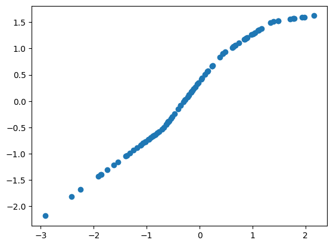

# Al基礎-Backpropagation

作者: CHUN-CHENG LIN
日期: 2024/07/05

---

## Neuron計算

Neuron計算的概念相對簡單，對於一個neuron而言，上一層的layer將output以對應的weight傳給當前的neuron。

$$z = w_1 x_1 + w_2 x_2 + b$$這裡假設上一層layer只有兩個neuron，其中$w_1、w_2$是當前的neuron給予上一層layer中neuron的weight，當前的neuron還有bias。
寫作矩陣式為:
$$Z = WX + B$$ $$
\begin{bmatrix}
    z_1
\end{bmatrix}=
\begin{bmatrix}
    w_1 & w_2
\end{bmatrix}
\begin{bmatrix}
    x_1\\
    x_2
\end{bmatrix}+
\begin{bmatrix}
    b_1
\end{bmatrix}
$$這是線性組合的計算過程，也是為什麼後面介紹到最基礎的layer稱作linear layer。

### python linear layer實作

import 需要的Lib

```py
import matplotlib.pyplot as plt
import numpy as np
from sklearn.datasets import make_regression
```

產生假數據

```py
X, Y = make_regression(100, n_features = 1, n_targets = 1, noise = 10, random_state = 3)
Y = Y.reshape((100, 1))
print(X.shape)
print(Y.shape)
plt.scatter(X, Y)
```


實作簡單的linear layer，有隨機的權重

```py
class Linear():
    def __init__(self, inDim: int, outDim: int):
        self.weight = np.random.rand(inDim, outDim)
        self.bias = np.random.rand(1, outDim)
    def __call__(self, x: np.ndarray):
        out = x.dot(self.weight) + self.bias
        return out
```

將數據帶入linear layer試試看

```py
l1 = Linear(1, 1)
out = l1(X)
plt.scatter(X, out)
```


在這裡由於weight與bias是隨機產生的，所以在此output的數值沒有意義，但是可以看到linear layer輸出的會是線性的。

## Activation function

### activation function的目的

由於上面的實驗可以發現，linear layer輸出會是線性(斜直線)的，這會導致整體的neural network只能擬合直線，就像是線性回歸中的回歸直線。
解決方法就是將$z = wx + b$的輸出$z$套入一個非線性的函式，也就是activation function，activation function可以很多樣也可以自己設計，有個限制是activation function必須是一階可微分的，原因在後面的backpropagation會解釋。

### 常見的activation function

1. ReLU
   
   $$ReLU(x) = max(0, x)$$
2. tanh
   
   $$tanh(x) = \frac{e^x-e^{-x}}{e^x+e^{-x}}$$
3. sigmoid
   
   $$sigmoid(x) = \frac{1}{1+e^{-x}}$$

### python activation function小實驗

```py
l1 = Layer.LinearLayer(1, 5)
relu1 = Layer.Relu()
l2 = Layer.LinearLayer(5, 1)
out = l1(X)
out = relu1(out)
out = l2(out)
plt.scatter(X, out)
```



可以看到activation function讓原本的斜直線產生了曲折，能夠擬合曲線的neural network更加的泛用。

## Gradient descent

> 複習Gradient descent

一個neural network中的參數描述成:
Network parameters $\theta = \left\{ w_1, w_2, \cdots, b_1, b_2, \cdots \right\}$
一開始的參數 $\theta^0$ 可以是隨機的數值，如何評估 $\theta$ 的好壞?主要是透過loss function $L(\theta)$，常見的loss function可以是mean-square error(MSE)，MSE的定義為:
$$MSE(y, \hat{y}) = \frac{1}{n} \sum_{i = 1}^{n} |(y_i - \hat{y}_i)^2|$$
去計算
$$\nabla L(\theta) = \begin{bmatrix}
    \frac{\partial L(\theta)}{\partial w_1}\\
    \frac{\partial L(\theta)}{\partial w_2}\\
    \vdots\\
    \frac{\partial L(\theta)}{\partial b_1}\\
    \frac{\partial L(\theta)}{\partial b_1}\\
    \vdots
\end{bmatrix}$$用這個gradient(是一個vector)去更新network parameters $\theta$，
$\theta^1 = \theta^0 - \eta \nabla L(\theta^0)$，$\theta^2 = \theta^1 - \eta \nabla L(\theta^1) \cdots$ 一路下去，然而一個neural network的參數的數量級龐大，需要一個更有效率的算法來更新這些參數($\eta$是學習率)。

## Backpropagation

> 數學背景要求: 微積分(不用高等)、懂chain rule、基本線性代數

這邊將loss function定義的廣泛一些:
$$L(\theta) = \sum_{n = 1}^{N} C^n(\theta)$$


$C^n$為NN輸出的$y^n$與實際的$\hat{y}^n$的差距(loss)，loss越小越好。
loss funtion的gradient計算為:
$$\frac{\partial L(\theta)}{\partial w} = \sum_{n = 1}^{N} \frac{\partial C^{n}(\theta)}{\partial w}$$所以不用會計算$\frac{\partial L(\theta)}{\partial w}$，問題變成如何計算$\frac{\partial C^{n}(\theta)}{\partial w}$，之後加總起來即可。
接下來問題是如何計算$\frac{\partial C^{n}(\theta)}{\partial w}$，先來看之前一個neuron的例子:

$$z = w_1 x_1 + w_2 x_2 + b$$由於$C$與輸出的$z$有關，$z$的參數有$w$，根據chain rule可以運算$\frac{\partial C}{\partial w} = \frac{\partial z}{\partial w} \frac{\partial C}{\partial z}$，其中計算$\frac{\partial z}{\partial w}$的過程稱作Forward pass，計算$\frac{\partial C}{\partial z}$的過程稱作Backward pass。
## 如何計算Forward pass


$$z = w_1 x_1 + w_2 x_2 + b$$
一樣先考慮一個neuron，可以發現計算$\frac{\partial z}{\partial w}$很簡單，先考慮$\frac{\partial z}{\partial w_1}$，可以馬上回答，因為$\frac{\partial z}{\partial w_1} = \frac{\partial (w_1 x_1 + w_2 x_2 + b)}{\partial w_1} = x_1$，$\frac{\partial z}{\partial w_2} = \frac{\partial (w_1 x_1 + w_2 x_2 + b)}{\partial w_2} = x_2$，規律就是那個weight對應的input即為forward pass的答案。
也就是可以馬上回答:

圖片取自於李弘毅老師的ppt([https://www.youtube.com/watch?v=ibJpTrp5mcE](https://www.youtube.com/watch?v=ibJpTrp5mcE))
上圖有function的neuron是activation function。
## Backward pass


考慮更複雜一點的情境，在上面的例子裡的neuron，輸出的$z$會在套入一個activation function(以淡藍色a代表)，這一層的neurons輸出會forward給下一層layer中的neurons，下一層的layer還會再forward給下下一層並以此邏輯forward下去(neuron的虛線箭頭是其他沒畫出來的上一層layer中的neurons forward過來的值)。
回到計算推導，$\frac{\partial C}{\partial w} = \frac{\partial z}{\partial w} \frac{\partial C}{\partial z}$，其中$\frac{\partial z}{\partial w}$在forward pass的討論中簡單解決，剩下$\frac{\partial C}{\partial z}$需要討論，由上圖可以發現activation function $a$的參數有$z$，最後的$C$又與$a$有關，$a(z)$的參數有$z$，一樣chain rule展開，$\frac{\partial C}{\partial z} = \frac{\partial a}{\partial z} \frac{\partial C}{\partial a}$，其中$\frac{\partial a}{\partial z}$其實就是activation function的導函式，這也是為什麼在activation function的介紹章節說activation function必須是一階可微分。
$\frac{\partial C}{\partial a}$又該如何計算，一樣觀察上圖的關係，$a$會影響到$z'$以及$z''$，所以一樣chain rule展開$\frac{\partial C}{\partial a} = \frac{\partial z'}{\partial a}\frac{\partial C}{\partial z'} + \frac{\partial z''}{\partial a} \frac{\partial C}{\partial z''}$(注意下一個layer只有兩個neuron是假設，如果有n個neurin，chain rule出來就會有n個要相加起來)，可以注意到一樣$\frac{\partial z'}{\partial a}$以及$\frac{\partial z''}{\partial a}$forward pass就算完了，分別等於$w_3$和$w_4$，但是$\frac{\partial C}{\partial z'}$還有$\frac{\partial C}{\partial z''}$我們不會算，注意到我們要算$\frac{\partial C}{\partial z}$之前要先知道$\frac{\partial C}{\partial z'}$與$\frac{\partial C}{\partial z''}$，$\frac{\partial C}{\partial z'}$與$\frac{\partial C}{\partial z''}$又以相同的chain rule展開下去才能知道答案，所以可以發現這是一個類似遞迴的關係式，那現在假設我們已經有辦法知道$\frac{\partial C}{\partial z'}$與$\frac{\partial C}{\partial z''}$的值，就能算出$\frac{\partial C}{\partial z} = a'(z)[w_3\frac{\partial C}{\partial z'} + w_4\frac{\partial C}{\partial z''}]$，注意算式中的$a'(z)$其實在運算時已經不是一個函式，而是一個固定的數值(因為$a'$不會變，且$z$在forward pass時已經固定)。

以圖示化表示，back pass的過程像是反向的neuron。
最後的問題剩下怎麼算$\frac{\partial C}{\partial z'}$和$\frac{\partial C}{\partial z''}$。

分兩個case討論:
+ Case 1: 已經是output layer
  
  $\frac{\partial C}{\partial z'}$和$\frac{\partial C}{\partial z''}$就已經是output layer，如此$\frac{\partial C}{\partial z'} = \frac{\partial y_1}{\partial z'}\frac{\partial C}{\partial y_1}$，其中$\frac{\partial y_1}{\partial z'}$只要知道activation function的導函式就算的出來了，而$\frac{\partial C}{\partial y_1}$就要根據loss function是怎麼定義的便有對應的導函式，所以$\frac{\partial C}{\partial z'}$就可以算出來，同理$\frac{\partial C}{\partial z''}$也可以算出來，這就是上述提到的遞迴式的終止條件。
+ Case 2: 不是output layer
  就是一直利用上述提到的遞迴式一路遞迴下去直到output，算完結果之後可以再一路算回來(計算方法如上述提到的$\frac{\partial C}{\partial z} = a'(z)[w_3\frac{\partial C}{\partial z'} + w_4\frac{\partial C}{\partial z''}]$)

然而實作時back pass自然不會從左邊算到右邊(沒效率)，而是從output layer一路算回來，這樣就像反向的forward pass，只需要算一遍即可。

## 總結
Backpropagation的步驟:
1. forward pass由左至右求出各項$\frac{\partial z}{\partial w}$
2. backward pass由右至左(output layer開始)求出各項$\frac{\partial C}{\partial z}$
3. 將forward pass以及backward pass對每項neuron計算出的$\frac{\partial z}{\partial w} \times \frac{\partial C}{\partial z} = \frac{\partial C}{\partial w}$，每個$\frac{\partial C}{\partial w}$加起來就能得到$\frac{\partial L(\theta)}{\partial w}$，用來調整neural network的parameters，NN才會越來越好。

## 利用numpy實作簡單linear layer以及backpropagation

導入Lib

```py
import matplotlib.pyplot as plt
import numpy as np
from sklearn.datasets import make_regression
```

產生假數據

```py
X, Y = make_regression(100, n_features = 1, n_targets = 1, noise = 10, random_state = 3)
Y = Y.reshape((100, 1))
print(X.shape)
print(Y.shape)
plt.scatter(X, Y)
```


定義linear layer以及Relu

```py
import numpy as np

class Linear():
    def __init__(self, inDim: int, outDim: int):
        self.weight = np.random.rand(inDim, outDim)
        self.bias = np.random.rand(1, outDim)
    def __call__(self, x: np.ndarray):
        out = x.dot(self.weight) + self.bias
        return out

class Relu():
    def __init(self):
        pass
    def __call__(self, x: np.ndarray):
        return np.maximum(0, x)
    def derivative(self, x: np.ndarray):
        return np.where(x > 0, np.ones_like(x), np.zeros_like(x))
```

設定learning rate

```py
learningRate = 0.01
```

實作backpropagation

```py
def backward(dz: np.ndarray, layer, layerIn: np.ndarray) -> np.ndarray:
    # w的梯度
    gw = layerIn.T.dot(dz)
    # b的梯度
    gb = np.sum(dz, axis = 0, keepdims = True)
    new_dz = dz.dot(layer.weight.T)
    layer.weight -= learningRate * gw
    layer.bias -= learningRate * gb
    return new_dz
```

訓練神經網路(沒有activation function版)

```py
l1 = Layer.Linear(1, 10)
l2 = Layer.Linear(10, 1)

for i in range(50):
    # forward pass
    out1 = l1(X)
    out2 = l2(out1)
    
    # 計算誤差，用MSE
    loss = np.mean(np.square(out2 - Y))
    print(loss)
    
    # backward pass
    dz2 = 2 * (out2 - Y) / out2.shape[0] # MES的導數
    dz1 = backward(dz2, l2, out1)
    _ = backward(dz1, l1, X)
    
# 跑跑看效果
out1 = l1(X)
prediction = l2(out1)
plt.plot(X, prediction)
plt.scatter(X, Y)
plt.show()
```


可以看到NN將數據擬和出類似回歸直線，可以用於預測。

訓練神經網路(有activation function版)

```py
l1 = Layer.Linear(1, 10)
relu1 = Layer.Relu()
l2 = Layer.Linear(10, 1)

for i in range(50):
    # forward pass
    out1 = l1(X)
    a1 = relu1(out1)
    out2 = l2(a1)
    
    # 計算誤差，用MSE
    loss = np.mean(np.square(out2 - Y))
    print(loss)
    
    # backward pass
    dz2 = 2 * (out2 - Y) / out2.shape[0] # MES的導數
    dz1 = backward(dz2, l2, out1)
    dz1 *= relu1.derivative(out1)
    _ = backward(dz1, l1, X)
    
# 跑跑看效果
out1 = l1(X)
a1 = relu1(out1)
prediction = l2(a1)
plt.scatter(X, prediction)
plt.scatter(X, Y)
plt.show()
```


可以發現加入relu後，原本只能擬和直線，現在可以擬和曲線，可以使預測更加準確。

## 用PyTorch驗證實驗結果

導入Lib

```py
import torch
import numpy as np
import matplotlib.pyplot as plt
from sklearn.datasets import make_regression
```

產生假數據

```py
X, Y = make_regression(100, n_features = 1, n_targets = 1, noise = 10, random_state = 3)
Y = Y.reshape((100, 1))
print(X.shape)
print(Y.shape)
plt.scatter(X, Y)
```


設定learning rate

```py
learningRate = 0.01
```

定義PyTorch NN

```py
class Network(torch.nn.Module):
    def __init__(self, inSize, outSize):
        super(Network, self).__init__()
        self.l1 = torch.nn.Linear(inSize, 10)
        self.l2 = torch.nn.Linear(10, 1)
    def forward(self, x):
        out = self.l1(x)
        out = self.l2(out)
        return out
```

訓練神經網路(沒有activation function版)

```py
feature = torch.from_numpy(X.astype(np.float32))
target = torch.from_numpy(Y.astype(np.float32))
model = Network(1, 1)
criterion = torch.nn.MSELoss()

for i in range(50):
    prediction = model(feature)
    loss = criterion(prediction, target)
    loss.backward()
    print(loss.item())
    model.l1.weight = torch.nn.Parameter(model.l1.weight - learningRate * model.l1.weight.grad)
    model.l1.bias = torch.nn.Parameter(model.l1.bias - learningRate * model.l1.bias.grad)
    model.l2.weight = torch.nn.Parameter(model.l2.weight - learningRate * model.l2.weight.grad)
    model.l2.bias = torch.nn.Parameter(model.l2.bias - learningRate * model.l2.bias.grad)

prediction = model(feature).detach().numpy()
plt.plot(X, prediction)
plt.scatter(X, Y)
```


可以看到PyTorch與numpy自製的NN在沒有activation function的時候擬和的直線是十分相似的

定義有activation function的NN

```py
class Network(torch.nn.Module):
    def __init__(self, inSize, outSize):
        super(Network, self).__init__()
        self.l1 = torch.nn.Linear(inSize, 10)
        self.relu1 = torch.nn.ReLU()
        self.l2 = torch.nn.Linear(10, 1)
    def forward(self, x):
        out = self.l1(x)
        out = self.relu1(out)
        out = self.l2(out)
        return out
```

訓練神經網路(有activation function版)

```py
feature = torch.from_numpy(X.astype(np.float32))
target = torch.from_numpy(Y.astype(np.float32))
model = Network(1, 1)
criterion = torch.nn.MSELoss()

optimizer = torch.optim.SGD(model.parameters(), lr = learningRate)

for i in range(50):
    prediction = model(feature)
    loss = criterion(prediction, target)
    optimizer.zero_grad()
    loss.backward()
    print(loss.item())
    optimizer.step()

prediction = model(feature).detach().numpy()
plt.scatter(X, prediction)
plt.scatter(X, Y)
```


注意這裡與numpy實驗不同的點在於有用到PyTorch的SGD，主要原因是PyTorch將backpropagation封裝了起來，為了驗證backpropagation的正確性以及便利性所以使用SGD，但是仍然可以發現到PyTorch擬和出的曲線與numpy實驗的十分相似，也代表著numpy實驗的正確性。