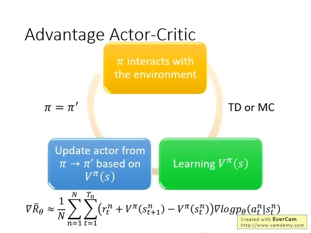
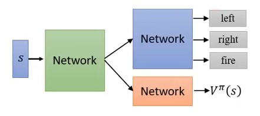
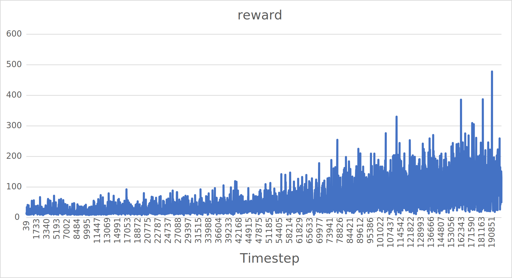
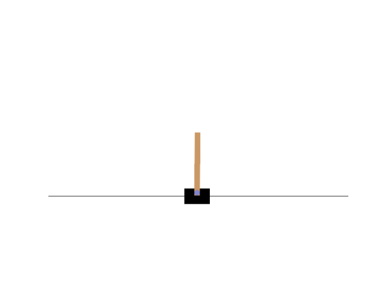
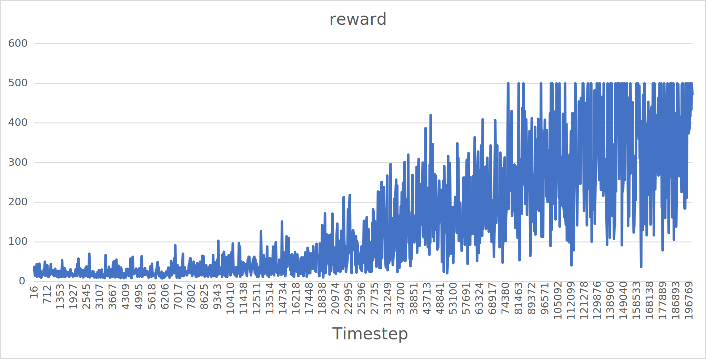
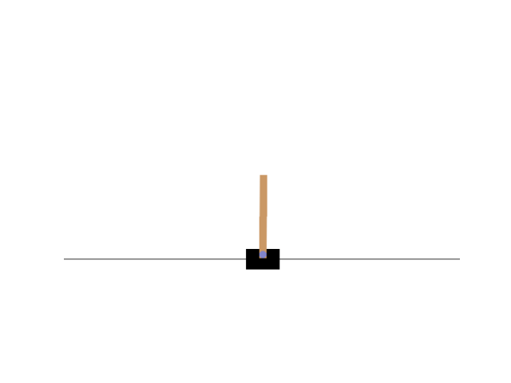

# Advantage Actor-Critic (A2C)

作者: CHUN-CHENG LIN
日期: 2024/08/12

---

> 在此會補回PPO中提到的訓練方式，若沒印象可以先看回PPO的文章，此外AC也會用到Q-learning。

## 複習-Policy Gradient

Policy gradient中參數更新的公式為:
$$\nabla \bar{R}_\theta \approx \frac{1}{N}\sum_{n = 1}^{N}\sum_{t = 1}^{T_n}(\sum_{t' = t}^{T_n}\gamma^{t'-t}r_{t'}^n - b)\nabla\ln p_\theta(a_t^n | s_t^n)$$裡面包含的技巧有:

+ discount factor $\gamma$
+ 減去baseline $b$

這樣的算式看起來複雜，所以改寫算式中的$\sum_{t' = t}^{T_n}\gamma^{t'-t}r_{t'}^n$為$G_t^n$。
整個算式中最不穩定的值是$G_t^n$，因為environment很可能具有隨機性，在不同階段也很可能看到一樣的state $s$做出相同的action $a$卻有不同的reward $r$，因此$G_t^n$事實上是一個random variable，為此我們只能sample出一定的$G_t^n$，倘若sample的數量太少運氣又不好，如此$G_t^n$將直接影響訓練過程。

在實務上sample $G_t^n$的次數也無法太多，因此sample的方式變得不切實際，為此學者思考能直接估計出$G$的期望值。
要估計的參數有累計reward、discount factor、baseline，想到value-based的RL NN，因此Q-Learning又再次偉大。

## 結合Q-Learning

$G_t^n = \sum_{t' = t}^{T_n}\gamma^{t'-t}r_{t'}^n$，會發現$G$的期望值其實就是$Q$:
$$\mathbb{E}[G_t^n] = Q^{\pi_\theta}(s_t^n, a_t^n)$$另外baseline有很多方式可以實作，但是一個常見做法是將$b$設為$V^{\pi_\theta}(s_t^n)$，理由是$V$事實上是$Q$的期望值，因為$V$不看action，$Q$考慮action，不同的$Q(s, a \in A)$分數有高有低，所有的action的期望值其實就是$V(s)$，期望值有平均的意味，所以$Q(s,a \in A) - V(s)$就會有正有負，以此達到baseline的效用。
經過此整合，policy-based與value-based應用在一起，成為Actor-Critic (AC)。

## Advantage Actor-Critic

上面的方式可以直接實作，但是可以發現為了估計$G$必須要用到$Q$與$V$，意味著需要兩個NN，如此估測失準的風險來源變成兩倍，因此開始思考$Q$與$V$的關係，想辦法只留下$Q$或$V$:
$$Q^\pi(s_t^n, a_t^n) = \mathbb{E}[r_t^n + V^\pi(s_{t + 1}^n)]$$其實就是$Q$定義的應用，注意到加上期望值是因為看到state $s$採取action $a$會得到怎樣的reward $r$以及$V$本身是具有隨機性的，然而有期望值會導致計算困難，因此大膽假設，直接將期望值拿掉:
$$Q^\pi(s_t^n, a_t^n) = r_t^n + V^\pi(s_{t + 1}^n)$$套入$G$及baseline變成:
$$Q^\pi(s_t^n, a_t^n) - V^\pi(s_t^n) \Rightarrow r_t^n + V^\pi(s_{t+1}^n) - V^\pi(s_t^n)$$此算式稱作"Advantage function"，這樣做的好處是只要有$V$一個NN即可，壞處是去掉期望值導致現在算式引入一個random variable $r_t^n$，但是考慮到$G$的隨機影響相較於$r_t^n$大的多(因為$G$是累積reward直到episode結束加上其他參數，而$r_t^n$只是某一個step中具有隨機性的reward)，因此還是做到了讓訓練過程更穩定一些的功效。
還有一個更實際的原因是A2C、A3C的論文經過許多實驗嘗試，結果是拿掉期望值的成效最好。

A2C的訓練循環:

圖片取自 李宏毅老師 [https://youtu.be/j82QLgfhFiY?si=7A7h-UEzsS8bwvZa&t=869](https://youtu.be/j82QLgfhFiY?si=7A7h-UEzsS8bwvZa&t=869)

## A2C小技巧

### 共用layer


因為policy NN與$V$的輸入都只有state $s$，所以其實前面的幾層layer是可以共用的，尤其假設今天是訓練Atari的遊戲，對於分析遊戲畫面的CNN可以減少記憶體空間需求(相同的CNN可以提供相同的輸入給policy NN以及$V$)。

### Exploration

作法是在actor輸出的distribution下一個constrain，讓action輸出的distribution entropy不要太小，讓不同的action被sample的機率盡量平均。

## 實驗A2C

### 共用layer版

超參數

```py
# ARG.py
gamma = 0.99

lr = 3e-4

Max_Timesteps_Per_Episode = 500
```

定義A2C用的Model

```py
# A2C_Model.py
import torch

class A2C_Model(torch.nn.Module):
    def __init__(self, n_state, n_action):
        super().__init__()
        self.l1 = torch.nn.Linear(n_state, 32)
        self.relu1 = torch.nn.ReLU()
        self.l2 = torch.nn.Linear(32, 32)
        self.relu2 = torch.nn.ReLU()
        
        self.actorOut = torch.nn.Linear(32, n_action)
        self.softmax = torch.nn.Softmax(dim = 1)
        self.criticOut = torch.nn.Linear(32, 1)
    def forward(self, x):
        out = self.l1(x)
        out = self.relu1(out)
        out = self.l2(out)
        out = self.relu2(out)
        
        action_prob = self.softmax(self.actorOut(out))
        V = self.criticOut(out)
        return action_prob, V
```

A2C agent

```py
# A2C.py
import torch

from A2C_Model import A2C_Model
import ARG

class A2C:
    def __init__(self, n_state, n_action, device):
        self.device = device
        self.model = A2C_Model(n_state, n_action).to(device)
        
        self.optimizer = torch.optim.Adam(self.model.parameters(), ARG.lr)
        self.mse = torch.nn.MSELoss()
        
    def selectAction(self, state):
        prob, _ = self.model(state)
        distribution = torch.distributions.Categorical(prob)
        action = distribution.sample()
        return action.item(), distribution.log_prob(action)
    
    def save(self):
        torch.save(self.model.state_dict(), "saved/A2C.pth")
        
    def load(self, modelPath: str):
        loaded = torch.load(modelPath)
        self.model.load_state_dict(loaded)
```

Just Buffer

```py
# Buffer.py
class Buffer:
    def __init__(self):
        self.states = []
        self.actions = []
        self.nextStates = []
        self.rewards = []
        self.dones = []
        self.log_probs = []
    def clear(self):
        self.states.clear()
        self.actions.clear()
        self.nextStates.clear()
        self.rewards.clear()
        self.dones.clear()
        self.log_probs.clear()
```

Environment

```py
# Env.py
import gym
import torch
import numpy as np
import matplotlib.pyplot as plt
from matplotlib import animation
import csv

from Buffer import Buffer
from A2C import A2C
from Logger import Logger
import ARG

def saveFramesToGif(frames, gifPath):
    patch = plt.imshow(frames[0])
    plt.axis("off")
    
    def animate(i):
        patch.set_data(frames[i])
    
    anim = animation.FuncAnimation(plt.gcf(), animate, frames = len(frames))
    anim.save(gifPath, writer = "ffmpeg", fps = 30)

class Env:
    def __init__(self, device, gameName: str, renderMode = "human"):
        self.env = gym.make(gameName, render_mode = renderMode)
        self.device = device
        self.buffer = Buffer()
        self.logger = Logger()
        self.history = {
            "timestep": [],
            "reward": []
        }
    
    def runOneEpisode(self, agent: A2C):
        self.buffer.clear()
        ep_t = 0
        state = self.env.reset()[0]
        
        for ep_t in range(1, ARG.Max_Timesteps_Per_Episode + 1):
            stateTensor = torch.tensor(state, dtype = torch.float32).unsqueeze(0).to(self.device)
            action, log_prob = agent.selectAction(stateTensor)
            nextState, reward, done, _, _ = self.env.step(action)
            self.buffer.states.append(state)
            self.buffer.actions.append(action)
            self.buffer.log_probs.append(log_prob)
            self.buffer.dones.append(done)
            self.buffer.rewards.append(reward)
            if (done):
                break
            state = nextState
        return ep_t
    
    def computeDiscountedRewards(self, rewards):
        discountedRewards = np.zeros_like(rewards)
        discountedReward = 0
        for t in reversed(range(len(rewards))):
            discountedReward = rewards[t] + ARG.gamma * discountedReward
            discountedRewards[t] = discountedReward
        return discountedRewards
    
    def train(self, agent: A2C, totalTimesteps: int):
        currTimesteps = 0
        while (currTimesteps < totalTimesteps):
            ep_t = self.runOneEpisode(agent)
            currTimesteps += ep_t
            
            states = torch.tensor(self.buffer.states, dtype = torch.float32).to(self.device)
            actions = torch.tensor(self.buffer.actions, dtype = torch.int32).reshape(-1, 1).to(self.device)
            
            discountedRewards = self.computeDiscountedRewards(self.buffer.rewards)
            discountedRewards = torch.tensor(discountedRewards, dtype = torch.float32).to(self.device)
            
            V = agent.model(states)[1].squeeze()
            # advantages
            A = discountedRewards - V.detach()
            # 標準化優化(幫助收斂，非必要)
            A = (A - A.mean()) / (A.std() + 1e-9)
            discountedRewards = discountedRewards.reshape(-1, 1)
            A = A.reshape(-1, 1)
            
            probs, V = agent.model(states)
            log_probs = torch.distributions.Categorical(probs).log_prob(actions.detach().squeeze())
            log_probs = log_probs.reshape(-1, 1)
            
            actorLoss = (-log_probs * A.detach()).mean()
            # critic用MSE loss即可
            criticLoss = agent.mse(discountedRewards, V)
            
            self.logger["time/current timestep"] = currTimesteps
            self.logger["train/actor loss"] = actorLoss.item()
            self.logger["train/critic Loss"] = criticLoss.item()
            self.logger["rollout/reward"] = sum(self.buffer.rewards)
            self.history["timestep"].append(currTimesteps)
            self.history["reward"].append(sum(self.buffer.rewards))
            self.logger.summary()
            
            loss = actorLoss + criticLoss
            agent.optimizer.zero_grad()
            loss.backward()
            agent.optimizer.step()
            
        self.saveHistory()
        self.env.close()
        
    def saveHistory(self):
        with open("saved/history.csv", "w", newline = "") as csvfile:
            writer = csv.writer(csvfile)
            writer.writerow(["timestep", "reward"])
            for t, reward in zip(self.history["timestep"], self.history["reward"]):
                writer.writerow([t, reward])
    
    @property
    def n_action(self):
        return self.env.action_space.n
    @property
    def n_state(self):
        return self.env.observation_space.shape[0]
```

注意到loss的計算是用相加的，這是網路資料查詢的結果，另外網路上的方式還會用到乘上權重、加上entropy用以explorate，但是經過我的實驗發現成果相差不明顯。

entrypoint

```py
# demo.py
from Env import Env
from A2C import A2C
import torch

if __name__ == "__main__":
    device = torch.device("cuda:0" if torch.cuda.is_available() else "cpu")
    
    env = Env(device, "CartPole-v1", "rgb_array")
    agent = A2C(env.n_state, env.n_action, device)
    env.train(agent, 200000)
    agent.save()
```



馬上就輸了。

### Actor Critic分開

超參數

```py
# ARG.py
gamma = 0.99

actor_lr = 3e-4
critic_lr = 3e-3

Max_Timesteps_Per_Episode = 500
```

定義Actor

```py
# PolicyNN.py
import torch

class PolicyNN(torch.nn.Module):
    def __init__(self, n_state, n_action):
        super().__init__()
        self.l1 = torch.nn.Linear(n_state, 32)
        self.relu1 = torch.nn.ReLU()
        self.l2 = torch.nn.Linear(32, 32)
        self.relu2 = torch.nn.ReLU()
        self.l3 = torch.nn.Linear(32, n_action)
        self.softmax = torch.nn.Softmax(dim = 1)
    def forward(self, x):
        out = self.l1(x)
        out = self.relu1(out)
        out = self.l2(out)
        out = self.relu2(out)
        out = self.l3(out)
        out = self.softmax(out)
        return out
```

定義Critic

```py
# ValueNN.py
import torch

class ValueNN(torch.nn.Module):
    def __init__(self, n_state):
        super().__init__()
        self.l1 = torch.nn.Linear(n_state, 32)
        self.relu1 = torch.nn.ReLU()
        self.l2 = torch.nn.Linear(32, 32)
        self.relu2 = torch.nn.ReLU()
        self.l3 = torch.nn.Linear(32, 1)
    def forward(self, x):
        out = self.l1(x)
        out = self.relu1(out)
        out = self.l2(out)
        out = self.relu2(out)
        out = self.l3(out)
        return out
```

A2C agent

```py
# A2C.py
import torch

from PolicyNN import PolicyNN
from ValueNN import ValueNN
import ARG

class A2C:
    def __init__(self, n_state, n_action, device):
        self.device = device
        self.actor = PolicyNN(n_state, n_action).to(device)
        self.critic = ValueNN(n_state).to(device)
        self.actorOptimizer = torch.optim.Adam(self.actor.parameters(), ARG.actor_lr)
        self.criticOptimizer = torch.optim.Adam(self.critic.parameters(), ARG.critic_lr)
        self.mse = torch.nn.MSELoss()
        
    def selectAction(self, state):
        prob = self.actor(state)
        distribution = torch.distributions.Categorical(prob)
        action = distribution.sample()
        return action.item(), distribution.log_prob(action)
    
    def save(self):
        torch.save(self.actor.state_dict(), "saved/actor.pth")
        torch.save(self.critic.state_dict(), "saved/critic.pth")
        
    def load(self, actorModelPath: str, criticModelPath: str):
        loaded = torch.load(actorModelPath)
        self.actor.load_state_dict(loaded)
        loaded = torch.load(criticModelPath)
        self.critic.load_state_dict(loaded)
```

Just Buffer

```py
# Buffer.py
class Buffer:
    def __init__(self):
        self.states = []
        self.actions = []
        self.nextStates = []
        self.rewards = []
        self.dones = []
        self.log_probs = []
    def clear(self):
        self.states.clear()
        self.actions.clear()
        self.nextStates.clear()
        self.rewards.clear()
        self.dones.clear()
        self.log_probs.clear()
```

Environment

```py
# Env.py
import gym
import torch
import numpy as np
import matplotlib.pyplot as plt
from matplotlib import animation
import csv

from Buffer import Buffer
from A2C import A2C
from Logger import Logger
import ARG

def saveFramesToGif(frames, gifPath):
    patch = plt.imshow(frames[0])
    plt.axis("off")
    
    def animate(i):
        patch.set_data(frames[i])
    
    anim = animation.FuncAnimation(plt.gcf(), animate, frames = len(frames))
    anim.save(gifPath, writer = "ffmpeg", fps = 30)

class Env:
    def __init__(self, device, gameName: str, renderMode = "human"):
        self.env = gym.make(gameName, render_mode = renderMode)
        self.device = device
        self.buffer = Buffer()
        self.logger = Logger()
        self.history = {
            "timestep": [],
            "reward": []
        }
    
    def runOneEpisode(self, agent: A2C):
        self.buffer.clear()
        ep_t = 0
        state = self.env.reset()[0]
        
        for ep_t in range(1, ARG.Max_Timesteps_Per_Episode + 1):
            stateTensor = torch.tensor(state, dtype = torch.float32).unsqueeze(0).to(self.device)
            action, log_prob = agent.selectAction(stateTensor)
            nextState, reward, done, _, _ = self.env.step(action)
            self.buffer.states.append(state)
            self.buffer.actions.append(action)
            self.buffer.log_probs.append(log_prob)
            self.buffer.dones.append(done)
            self.buffer.rewards.append(reward)
            if (done):
                break
            state = nextState
        return ep_t
    
    def computeDiscountedRewards(self, rewards):
        discountedRewards = np.zeros_like(rewards)
        discountedReward = 0
        for t in reversed(range(len(rewards))):
            discountedReward = rewards[t] + ARG.gamma * discountedReward
            discountedRewards[t] = discountedReward
        return discountedRewards
    
    def train(self, agent: A2C, totalTimesteps: int):
        currTimesteps = 0
        while (currTimesteps < totalTimesteps):
            ep_t = self.runOneEpisode(agent)
            currTimesteps += ep_t
            
            states = torch.tensor(self.buffer.states, dtype = torch.float32).to(self.device)
            actions = torch.tensor(self.buffer.actions, dtype = torch.int32).reshape(-1, 1).to(self.device)
            
            discountedRewards = self.computeDiscountedRewards(self.buffer.rewards)
            discountedRewards = torch.tensor(discountedRewards, dtype = torch.float32).to(self.device)
            
            V = agent.critic(states).squeeze()
            # advantages
            A = discountedRewards - V.detach()
            # 標準化優化(幫助收斂，非必要)
            A = (A - A.mean()) / (A.std() + 1e-9)
            discountedRewards = discountedRewards.reshape(-1, 1)
            A = A.reshape(-1, 1)
            
            V = agent.critic(states)
            probs = agent.actor(states)
            log_probs = torch.distributions.Categorical(probs).log_prob(actions.detach().squeeze())
            log_probs = log_probs.reshape(-1, 1)
            
            actorLoss = (-log_probs * A.detach()).mean()
            # critic用MSE loss即可
            criticLoss = agent.mse(discountedRewards, V)
            
            self.logger["time/current timestep"] = currTimesteps
            self.logger["train/actor loss"] = actorLoss.item()
            self.logger["train/critic Loss"] = criticLoss.item()
            self.logger["rollout/reward"] = sum(self.buffer.rewards)
            self.history["timestep"].append(currTimesteps)
            self.history["reward"].append(sum(self.buffer.rewards))
            self.logger.summary()
            
            agent.actorOptimizer.zero_grad()
            actorLoss.backward()
            agent.actorOptimizer.step()
            
            agent.criticOptimizer.zero_grad()
            criticLoss.backward()
            agent.criticOptimizer.step()
        self.saveHistory()
        self.env.close()
        
    def saveHistory(self):
        with open("saved/history.csv", "w", newline = "") as csvfile:
            writer = csv.writer(csvfile)
            writer.writerow(["timestep", "reward"])
            for t, reward in zip(self.history["timestep"], self.history["reward"]):
                writer.writerow([t, reward])
    
    @property
    def n_action(self):
        return self.env.action_space.n
    @property
    def n_state(self):
        return self.env.observation_space.shape[0]
```

entrypoint

```py
# demo.py
from Env import Env
from A2C import A2C
import torch

if __name__ == "__main__":
    device = torch.device("cuda:0" if torch.cuda.is_available() else "cpu")
    
    env = Env(device, "CartPole-v1", "rgb_array")
    agent = A2C(env.n_state, env.n_action, device)
    env.train(agent, 200000)
    agent.save()
```




經過查詢資料以及多次嘗試，發現到共用layer的方式雖然reward是呈現上升，但是學習不穩定，也學得很慢，反而將actor、critic分開學習的更加明顯，我想可能是loss的計算我理解的還有問題，因為actor的loss都很小，但critic loss經常計算出一下個位數一下又1000多的情況，直接相加可能導致loss對actor的調整不正確，同時網路上資料說A2C本身收斂性不好，因此A2C應該被視為RL發展過程的技術即可，通常不考慮作為首選。