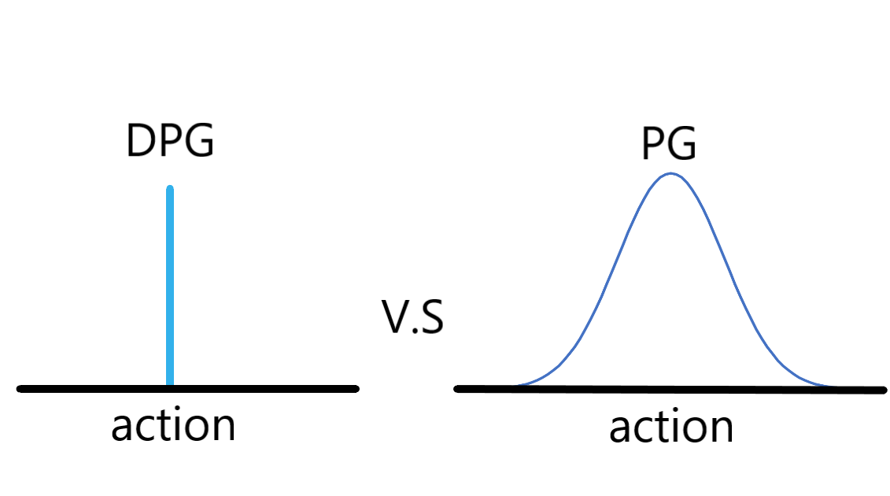

# Deep Deterministic Policy Gradient (DDPG)

作者: CHUN-CHENG LIN
日期: 2024/08/13

---

## 前言

DDPG 屬於actor-critic架構，其創新在於結合DPG與DQN的優點，在target NN的更新改用soft update而不是DQN中的直接複製，另外DDPG適用於連續action space(反而在離散action上沒有優勢)，同時結合DQN的replay buffer以改善資料樣本利用效率，在一定層面可將DDPG視為DQN的連續action space延伸版。

## 原理簡介

### 與Policy Gradient的不同

以往policy gradient在處理連續空間時是輸出常態分布的$\mu$與$\sigma$，建立distribution後sample出action。
Deterministic policy gradient(DPG)不用這種方式，DPG之所以為deterministic是因為DPG對於每一個action只會輸出一個決定性的數值(浮點)。

