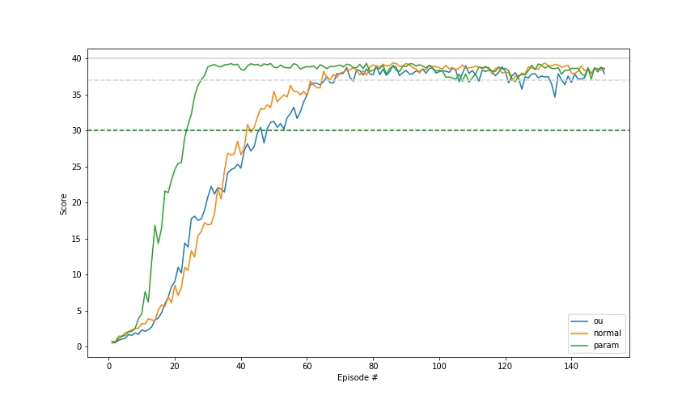
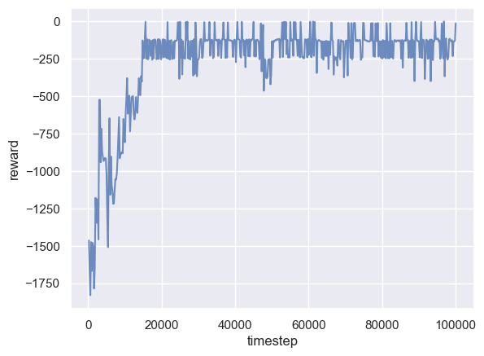
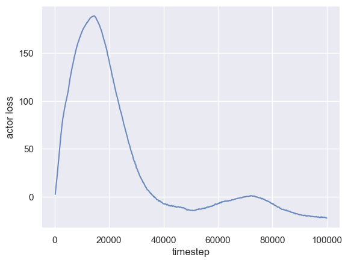
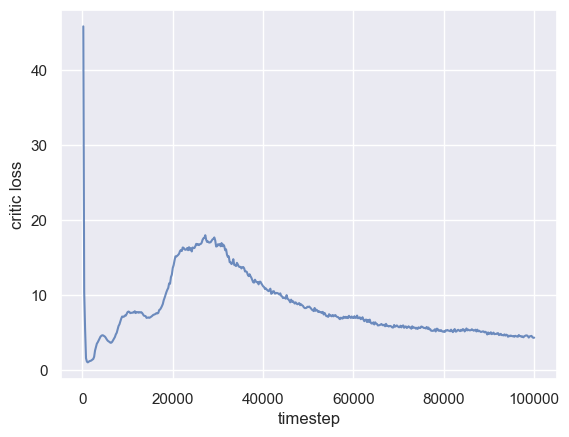

# Deep Deterministic Policy Gradient (DDPG)

作者: CHUN-CHENG LIN
日期: 2024/08/13

---

❌ Discrete action space
✔️ Continuous action space

## 前言

DDPG 屬於Actor-Critic架構，其創新在於結合DPG與DQN的優點，在target NN的更新改用soft update而不是DQN中的直接複製，另外DDPG適用於連續action space(反而在離散action space上沒有優勢)，同時結合DQN的replay buffer以改善資料樣本利用效率，在一定層面可將DDPG視為DQN的連續action space延伸版。

## 原理簡介

### 與Policy Gradient的不同

以往policy gradient在處理連續空間時是輸出常態分布的$\mu$與$\sigma$，建立distribution後sample出action。
Deterministic policy gradient(DPG)不用這種方式，DPG之所以為deterministic是因為DPG對於每一個action只會輸出一個決定性的數值(浮點)。


### DQN 複習

DQN沒有actor，而是利用$\mathop{\arg\max}\limits_{a}Q^{\pi_\theta}(s, a)$找可使$Q$最大的action $a$作為下個動作，此時policy $\pi_\theta = \mathop{\arg\max}\limits_{a}Q^{\pi_\theta}(s, a)$。
DQN的loss計算方式為:
$$y_i = r_i + \gamma (1 - d_i)\mathop{\max}\limits_{a'}\hat{Q}(s_{i+1}, a')$$ $$L = \frac{1}{|\mathcal{B}|}\sum_{(s_i, a_i, r_i, s_{i+1}, d_i) \in \mathcal{B}}(y_i - Q(s_i, a_i))^2$$DQN取得了很好的成績，但$\argmax$的操作意味著只能用在離散action space。

### DDPG算法

#### DDPG的成員

DDPG屬於Actor-Critic架構，因此DDPG也有actor與critic，DDPG的actor用policy gradient的技術，critic用類DQN的Q function，DDPG中有$Q_\theta$以及target $Q_{\hat{\theta}}$，actor方面在DDPG中寫作$\mu_\theta(s)$，同時還有target actor $\mu_{\hat{\theta}}$，理由與$Q$為什麼要有target NN是一樣的。
DDPG利用policy gradient解決連續action space的問題，$\mu_\theta(s)$輸出的是一個決定性的數值，不再以distribution sample。

#### DDPG-Select Action

DDPG的演算法大部分與DQN相同，因此可以從DQN推DDPG的演進。
DQN中取得select action的方式是利用$Q_\theta$，DDPG有了actor便是使用actor決策動作:
$$a = \mu_\theta(s)$$但是DQN的$\epsilon$-greedy不太適合DDPG，為此DDPG改成對輸出的數值加上噪音以增加exploration:
$$a = clip(\mu_\theta(s) + \epsilon, a_{low}, a_{high}), \epsilon \sim \mathcal{N}$$其中噪音是mean-zero Gaussian noise抽出，讀者可能會覺得直接用一個與NN無關的noise有些粗糙，可能認為訓練時間與noise應該要有關聯，事實上DDPG的原文作者推薦的是"OU noise"，實作上要需要的程式很多，但是OpenAI以及一些論文研究發現用無相關的Gaussian noise效果與OU noise相差不大，且Gaussian noise實作非常簡單，因此現在多改為只用Gaussian noise。

+ [OpenAI DDPG介紹](https://spinningup.openai.com/en/latest/algorithms/ddpg.html)
+ [關於noise在exploration的論文](https://arxiv.org/abs/1706.01905)
+ [Noise對DDPG影響比較的好文章(下圖作者文章)](https://soeren-kirchner.medium.com/deep-deterministic-policy-gradient-ddpg-with-and-without-ornstein-uhlenbeck-process-e6d272adfc3)


可以發現Gaussian noise與OU noise的訓練過程十分相似，圖中的綠線是原文作者對訓練過程自適應調整，效果更好，但是此圖告訴我們的是用Gaussian就足夠好了。

#### DDPG-梯度更新

##### Critic

DQN中的TD-target是$r_i + \mathop{\max}\limits_{a'}\hat{Q}(s_{i+1}, a')$，但現在DDPG是處理連續action space，取argmax的操作就變得不實際，既然select action的操作已經交給$\mu_\theta$，而原本$\mathop{\max}\limits_{a'}\hat{Q}(s_{i+1}, a')$是找出action $a'$使$Q$值最大，如此進行梯度上升，利用調整完的Qtable可找到更好的policy(詳細看RL_DQN一文)，對於DDPG而言，我們相信(假設)$\mu_\theta$輸出的action就是最好的action，因此將$\mathop{\max}\limits_{a'}\hat{Q}(s_{i+1}, a')$近似為$\hat{Q}(s_{t+1}, \mu_\theta(s_{t+1}))$，這也代表當actor $\mu_\theta$學習變好時critic $Q$也會跟著進步。
$$y_i = r_i + (1 - d_i)\gamma \hat{Q}(s_{t+1}, \mu_{\hat{\theta}}(s_{i+1}))$$ $$L = \frac{1}{|\mathcal{B}|}\sum_{(s_i,a_i,r_i,s_{i+1},d_i)\in\mathcal{B}} (y_i - Q(s_i, a_i))^2$$其中的$a_i$是有加上噪音的action。

##### Actor

講完了critic後就來討論actor，DDPG的policy $\mu_\theta(s)$給出連續action space的$a$，我們看完critic可知我們希望$\mu_\theta(s)$輸出的會是可使$Q(s, a)$最大的$a$，因此目標函式就很明確了:
$$J = \mathop{\max}\limits_{\theta}\mathbb{E}_{s \sim \mathcal{D}}[Q_\phi(s, \mu_\theta(s))]$$，由於action space是連續空間，在此做一個假設: $Q$對$\theta$可微，因此policy的梯度更新為:
$$\nabla_\theta J = \nabla_\theta \frac{1}{|\mathcal{B}|}\sum_{s\in\mathcal{B}}Q_\phi(s, \mu_\theta(s))$$其實很直覺，$Q$值高的動作要增加出現的機率，所以$Q$值越大loss越小，所以$Q$值就可以幫助我們gradient ascent(加個負號做gradient descent)。

##### Soft Update

一般的DQN用的是hard update，也就是一段時間(如200次step)後直接複製當前$\theta$取代target NN的$\hat{\theta}$:
$$\hat{\theta} \gets \theta$$在DDPG中作者並不使用hard update，而是"soft update"，其方法是:
$$\hat{\theta} \gets \tau \theta + (1 - \tau)\hat{\theta}$$其中$0 < \tau \ll 1$，且soft update是每一次update $\theta$後會一起用soft update更新$\hat{\theta}$，soft update的好處因為target改變的速度較為穩定，所以收斂較快，缺點是更容易發生overestimation，這問題到DDPG的改良版TD3得到解決。

## 實驗

超參數

```py
# ARG.py
Gamma = 0.99
GaussianNoiseSigma = 0.2 # gaussian noise 的標準差
GaussianNoiseSigmaDecay = 0.99
GaussianNoiseSigma_min = 0.005

Tau = 0.005 # soft update 係數

Actor_lr = 3e-4
Critic_lr = 3e-4

Max_Timesteps_Per_Episode = 200

BatchSize = 256

# 在正式開始前需要先經過多少timestep
initReplayBufferSize = 1000
MemoryCapacity = 100000
```

Replay Buffer

```py
import numpy as np

class RelplayBuffer:
    def __init__(self, stateDim, batchSize, bufferSize):
        self.batchSize = batchSize
        self.maxSize = bufferSize
        # ReplayBuffer的pointer，代表現在要寫入的位置
        self.ptr = 0
        self.currSize = 0
        
        self.state = np.zeros(shape = (self.maxSize, stateDim), dtype = np.float32)
        self.action = np.zeros(shape = (self.maxSize, 1), dtype = np.float32)
        self.nextState = np.array(self.state, dtype = np.float32)
        self.reward = np.zeros(shape = (self.maxSize, 1), dtype = np.float32)
        self.done = np.zeros(shape = (self.maxSize, 1), dtype = np.int32)
        
    def push(self, state, action, nextState, reward, done):
        self.state[self.ptr] = state
        self.action[self.ptr][0] = action
        self.nextState[self.ptr] = nextState
        self.reward[self.ptr][0] = reward
        self.done[self.ptr][0] = done
        
        self.ptr = (self.ptr + 1) % self.maxSize
        self.currSize = min(self.currSize + 1, self.maxSize)
        
    def sample(self):
        index = np.random.randint(0, self.currSize, size=self.batchSize)
        return (
            self.state[index],
            self.action[index],
            self.nextState[index],
            self.reward[index],
            self.done[index]
        )
    def __len__(self):
        return self.currSize
```

Gaussian Noise

```py
# NormalNoise
import numpy as np

class NormalNoise:
    def __init__(self, mean, sigma):
        self.mu = mean
        self.sigma = sigma
    def __call__(self):
        return np.random.normal(self.mu, self.sigma)
```

Actor NN

```py
# ActorNN.py
import torch as th

class ActorNN(th.nn.Module):
    def __init__(self, n_state, n_action, bound):
        super().__init__()
        self.bound = bound
        
        self.l1 = th.nn.Linear(n_state, 32)
        self.relu1 = th.nn.ReLU()
        self.l2 = th.nn.Linear(32, n_action)
        self.tanh1 = th.nn.Tanh()
    def forward(self, x):
        out = self.l1(x)
        out = self.relu1(out)
        out = self.l2(out)
        # tanh是為了將輸出縮放到[-1, 1]之間，
        # 乘上bound可說放到遊戲的action範圍 -> [-bound, bound]
        out = self.bound * self.tanh1(out)
        return out
```

Critic NN

```py
# CriticNN.py
import torch as th

class CriticNN(th.nn.Module):
    def __init__(self, n_state, n_action):
        super().__init__()
        self.l1 = th.nn.Linear(n_state + n_action, 32)
        self.relu1 = th.nn.ReLU()
        self.l2 = th.nn.Linear(32, 32)
        self.relu2 = th.nn.ReLU()
        self.l3 = th.nn.Linear(32, 1)
    def forward(self, state, action):
        x = th.cat([state, action], dim = 1)
        out = self.l1(x)
        out = self.relu1(out)
        out = self.l2(out)
        out = self.relu2(out)
        out = self.l3(out)
        return out
```

DDPG算法本身

```py
# DDPG.py
import torch as th
import numpy as np
import ARG
from ActorNN import ActorNN
from CriticNN import CriticNN
from ReplayBuffer import RelplayBuffer
from NormalNoise import NormalNoise

class DDPG:
    def __init__(self, n_state, n_action, bound, device):
        self.n_action = n_action
        self.device = device
        self.bound = bound
        
        self.normalNoise = NormalNoise(np.zeros(n_action), ARG.GaussianNoiseSigma * np.ones(n_action))
        
        self.replayBuffer = RelplayBuffer(n_state, ARG.BatchSize, ARG.MemoryCapacity)
        self.actor = ActorNN(n_state, n_action, bound).to(device)
        self.critic = CriticNN(n_state, n_action).to(device)
        self.actor_target = ActorNN(n_state, n_action, bound).to(device)
        self.critic_target = CriticNN(n_state, n_action).to(device)
        
        self.actor_target.load_state_dict(self.actor.state_dict())
        self.critic_target.load_state_dict(self.critic.state_dict())
        
        self.actorOptimizer = th.optim.Adam(self.actor.parameters(), ARG.Actor_lr)
        self.criticOptimizer = th.optim.Adam(self.critic.parameters(), ARG.Critic_lr)

        self.mse = th.nn.MSELoss()
    def selectAction(self, state):
        action = self.actor(state).item()
        action = np.clip(action + self.normalNoise(), -self.bound, self.bound)
        return action
    def storeTransition(self, s, a, ns, r, d):
        self.replayBuffer.push(s, a, ns, r, d)
    # 只更新部分參數
    def softUpdate(self, NN: th.nn.Module, targetNN: th.nn.Module):
        for param, targetParam in zip(NN.parameters(), targetNN.parameters()):
            targetParam.data.copy_(ARG.Tau * param.data  + (1 - ARG.Tau) * targetParam.data)
    def train(self):
        self.actor.train(True)
        self.critic.train(True)
        states, actions, nextStates, rewards, dones = self.replayBuffer.sample()
        states = th.tensor(states, dtype = th.float32).to(self.device)
        actions = th.tensor(actions, dtype = th.float32).to(self.device)
        nextStates = th.tensor(nextStates, dtype = th.float32).to(self.device)
        rewards = th.tensor(rewards, dtype = th.float32).to(self.device)
        dones = th.tensor(dones, dtype = th.int32).to(self.device)
        
        with th.no_grad():
            nextActions = self.actor_target(nextStates)
            q_next = self.critic_target(nextStates, nextActions)
            q_target = rewards + ARG.Gamma * (1 - dones) * q_next
        q = self.critic(states, actions)
        # 加上mean是因為pytorch的MSE沒有取mean
        criticLoss = th.mean(self.mse(q_target, q))
        self.criticOptimizer.zero_grad()
        criticLoss.backward()
        self.criticOptimizer.step()
        
        action_eval = self.actor(states)
        scores = self.critic(states, action_eval)
        actorLoss = -th.mean(scores)
        self.actorOptimizer.zero_grad()
        actorLoss.backward()
        self.actorOptimizer.step()
        
        # 軟更新targetNN
        self.softUpdate(self.actor, self.actor_target)
        self.softUpdate(self.critic, self.critic_target)
        
        return actorLoss.item(), criticLoss.item()

    def save(self):
        th.save(self.actor.state_dict(), "./saved/Actor.pth")
        th.save(self.critic.state_dict(), "./saved/Critic.pth")
    def load(self, actorPath, criticPath):
        loaded = th.load(actorPath)
        self.actor.load_state_dict(loaded)
        self.actor_target.load_state_dict(self.actor.state_dict())
        loaded = th.load(criticPath)
        self.critic.load_state_dict(loaded)
        self.critic_target.load_state_dict(self.critic.state_dict())
```

定義environment

```py
# Env.py
import gym
import numpy as np
import torch
import matplotlib.pyplot as plt
from matplotlib import animation

from DDPG import DDPG
from Logger import Logger
import ARG

def saveFramesToGif(frames, gifPath):
    patch = plt.imshow(frames[0])
    plt.axis("off")
    
    def animate(i):
        patch.set_data(frames[i])
    
    anim = animation.FuncAnimation(plt.gcf(), animate, frames = len(frames))
    anim.save(gifPath, writer = "ffmpeg", fps = 30)

class Env:
    def __init__(self, device, gameName: str, renderMode = "human"):
        self.env = gym.make(gameName, render_mode = renderMode)
        self.device = device
        self.logger = Logger()
        self.trainTimestep = 0
    
    def runOneEpisode(self, agent: DDPG):
        state = self.env.reset()[0]
        ep_return = 0
        ep_t = 1
        ep_train_timestep = 0
        ep_actorLoss = 0
        ep_criticLoss = 0
        for ep_t in range(1, ARG.Max_Timesteps_Per_Episode + 1):
            stateTensor = torch.tensor(state, dtype = torch.float32).unsqueeze(0).to(self.device)
            action = agent.selectAction(stateTensor)
            nextState, reward, done, _, _ = self.env.step(action)
            ep_return += reward
            agent.storeTransition(state, action, nextState, reward, done)
            
            if (len(agent.replayBuffer) > ARG.initReplayBufferSize):
                ep_train_timestep += 1
                actorLoss, criticLoss = agent.train()
                ep_actorLoss += actorLoss
                ep_criticLoss += criticLoss
            state = nextState
            
            if (done):
                break
            if (ep_t == ARG.Max_Timesteps_Per_Episode):
                break
        if (ep_train_timestep != 0):
            self.trainTimestep += ep_train_timestep
            self.logger.history["reward"].append(ep_return)
            self.logger.history["timestep"].append(self.trainTimestep)
            self.logger.history["actor loss"].append(ep_actorLoss / ep_train_timestep)
            self.logger.history["critic loss"].append(ep_criticLoss / ep_train_timestep)
            print("| Episode reward: %10.4f | Actor loss: %10.4f | Critic loss: %10.4f | normal sigma: %6f |" % (ep_return, ep_actorLoss / ep_train_timestep, ep_criticLoss / ep_train_timestep, agent.normalNoise.sigma))
        return ep_train_timestep

    def train(self, agent: DDPG, totalTimesteps: int):
        currTimesteps = 0
        while (currTimesteps < totalTimesteps):
            print("[INFO] CurrTimesteps: %8d" % (currTimesteps))
            currTimesteps += self.runOneEpisode(agent)
            agent.normalNoise.sigma = max(ARG.GaussianNoiseSigmaDecay * agent.normalNoise.sigma, ARG.GaussianNoiseSigma_min)
        self.env.close()
        self.logger.saveHistory()

    def runOneEpisode_evaluate(self, agent: DDPG, maxTimestep, frames: list):
        state = self.env.reset()[0]
        ep_return = 0
        ep_t = 1
        for ep_t in range(1, maxTimestep + 1):
            frames.append(self.env.render())
            stateTensor = torch.tensor(state, dtype = torch.float32).unsqueeze(0).to(self.device)
            action = agent.actor(stateTensor).item()
            nextState, reward, done, _, _ = self.env.step([action])
            ep_return += reward
            agent.storeTransition(state, action, nextState, reward, done)
            state = nextState
            if (done):
                break
            if (ep_t == maxTimestep):
                break
        print("| Episode reward: %10.4f |" % (ep_return))
        
        return ep_return, ep_t

    def evaluate(self, agent: DDPG, iterNum: int):
        agent.actor.train(False)
        agent.critic.train(False)
        frames = []
        for episode in range(1, iterNum + 1):
            print("Episode: %8d" % (episode))
            ep_return, ep_t = self.runOneEpisode_evaluate(agent, 200, frames)
        saveFramesToGif(frames, "./evaluate.gif")
        self.env.close()

    @property
    def n_action(self):
        return self.env.action_space.shape[0]
    @property
    def n_state(self):
        return self.env.observation_space.shape[0]
```

實驗的entrypoint

```py
from Env import Env
from DDPG import DDPG
import torch as th
import numpy as np
import random

def setSeed(seed = 42, loader = None):
    random.seed(seed) 
    np.random.seed(seed)
    th.manual_seed(seed)
    if th.cuda.is_available():
        th.cuda.manual_seed(seed)
        th.cuda.manual_seed_all(seed) 
    th.backends.cudnn.benchmark = False
    th.backends.cudnn.deterministic = True        
    try:
        loader.sampler.generator.manual_seed(seed)
    except AttributeError:
        pass

if __name__ == "__main__":
    setSeed()
    device = th.device("cuda:0" if th.cuda.is_available() else "cpu")
    
    env = Env(device, "Pendulum-v1", "rgb_array")
    agent = DDPG(env.n_state, env.n_action, 2, device)
    env.train(agent, 100000)
    agent.save()
```

Reward

Actor loss

Critic loss

可以發現到DDPG的reward很早就達到收斂的分數(0 ~ -200主要是因為Pendulum-v1的reward function設計導致，遊戲在將棒子甩上去的過程中會先扣分，接近0的reward是因為遊戲初始化在棒子立好的地方)，所以DDPG的效果還不錯，另外發現到DDPG的棒子在立好後基本不會再動，反觀PPO的結果會有些微晃動，我猜這就是DDPG deterministic的功勞。
