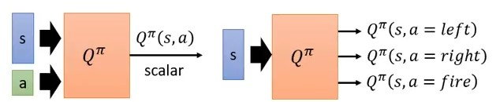

# Deep Q-Learning Network (DQN)

作者: CHUN-CHENG LIN
日期: 2024/07/29

---

## Value based vs Policy based

之前提到的policy gradient以及其延伸算法是屬於policy based，而DQN是屬於value based的訓練方式。

+ Policy based: NN看到一個state $s$ 後輸出每個action的機率值，利用每一個action的機率$p(a), a \in A$，利用這些$p(a)$做機率分布distribution sample出下一個採取的動作。
+ Value based: NN看到一個state $s$ 後輸出的是一路玩到結束的期望累計分數。

## Critic ($V^\pi$)

### 說明—State value function

Critic不是像actor一樣直接決定下一個action的機率，Critic是評估actor的policy $\pi$ 的好壞，定義上寫作$V^\pi(s)$，其意義是採取policy $\pi$ 的條件下，看到state $s$ 後一路累積到結束的期望累計分數。

> 小複習: policy $\pi$ 的定義是 $\pi: S \to A$，也就是$\pi(s) = a, s \in S, a \in A$，state集合 $S$ 與action集合 $A$ 的mapping。

注意，critic並不能單獨評斷state的好壞，因為critic不能採取action，action的決策取決於actor的policy，因此critic要評估之前要綁定一個policy才能評估期望分數，所以很可能對於不同的policy而言，相同的state會評估出不同的分數。

### 如何評估$V^\pi(s)$

#### Monte-Carlo based (MC based)

Monte-Carlo based很直覺，就是讓actor去與environment互動，然後統計看到state $s_a$後分數有多大(假設累計分數為$G_a$)以及看到state $s_b$後分數有多大($G_b$)，這樣就可以算出期望累計分數，這可以實作table作映射，然而假設今天是玩遊戲，state是遊戲的畫面，基本上不可能枚舉出所有遊戲的畫面可能性，如此用table變得不切實際，因此table的方法不行，就是改用function的時候，而這個function就是NN，NN的好處是即便遇到沒遇過的state，NN還是會想辦法輸出一個值(即便是random)，NN輸出$V^\pi(s_a)、V^\pi(s_b)$，這變成regression problem，目標是讓NN的$V^\pi(s_a)、V^\pi(s_b)$與實際的$G_a、G_b$越靠近越好。

#### Temporal-difference based (TD based)

MC based有個問題，它的計算量很大，因為必須要玩完整個episode才能計算$G$，假設episode很長就沒辦法簡單的模擬。

> 複習: episode的過程可以被描述成一串序列 $s_1, a_1, r_1, s_2 ... s_t, a_t, r_t, s_{t + 1}$

利用episode的序列可以發現到一個重要的關係式:
$$V^\pi(s_t) = V^\pi(s_{t + 1}) + r_t$$這個式子帶給我們新的訓練方式:
將$s_t$輸入NN得到$V^\pi(s_t)$，輸入$s_{t+1}$得到$V^\pi(s_{t+1})$，目標是讓$V^\pi(s_t) - V^\pi(s_{t+1})$與實際的$r_t$越接近越好，利用$V^\pi(s_t) - V^\pi(s_{t+1}) \leftrightarrow r_t$的loss可以訓練NN。
TD based有可以step更新的好處，但是假設$V^\pi$估的不準，此時應用$V^\pi(s_t) = V^\pi(s_{t + 1}) + r_t$估出來的也會不準。

> MC與TD估出來的值很可能會不一樣，但不代表誰對誰錯，原因是計算方法不同。

## Another Critic ($Q^\pi$)

### 說明—State-action value function

$Q^\pi(s, a)$可以說是$V^\pi(s)$的延伸版，$Q^\pi(s, a)$的定義是當actor看到state $s$ 後**一定**採取action $a$ 且接下來都採用policy $\pi$ 一路玩到結束的期望累計分數。

### 實作與理論的差異

圖片取自 李宏毅老師 [https://youtu.be/o_g9JUMw1Oc?si=OarFwW3faXeIwHLH&t=1103](https://youtu.be/o_g9JUMw1Oc?si=OarFwW3faXeIwHLH&t=1103)
這是$Q^\pi$的實作方式，左邊是像定義一樣輸入state $s$ 以及action $a$ 然後NN輸出該state action pair的期望累計分數，但是右邊更加常用，右邊的方式是只輸入state $s$ ，NN輸出的是動作空間中所有action $a, a \in A$的期望累計分數，右邊的NN一次輸出所有的state action pair的期望值，這在實作時方便許多，因此更為常用，但是雖然實作方式有改變，但在數學上的表示法還是統一的。
可以注意到這樣的實作方式代表著DQN適用於離散動作空間，基本上處理連續動作空間DQN沒有優勢，一般不考慮。

## Q-Learning

Q-learning是DQN的前身，所以在推導DQN之前應先了解Q-learning，Q-learning較屬於傳統機器學習的範疇，因此在原本的Q-learning中沒有NN的存在。

### Q-Learning訓練方式

可能讀者會好奇，上面文章講了半天似乎都在講critic的應用，但critic又不會與environment互動，那要怎麼讓actor學會與environment交互?
這邊先劇透，其實Q-learning中並沒有實作actor(policy)，只有critic($Q^\pi$)，但是有$Q^\pi$其實就可以訓練出actor(policy)，訓練過程會像是:

只要有訓練好的$Q^\pi$就能找到更好的policy $\pi'$，$\pi'$再繼續與environment互動，用$\pi'$互動的結果訓練$Q^\pi$，不斷循環，policy就會越來越好。

#### 什麼叫做比較好的policy

上面提到我們可以不斷的找到更好的policy，但什麼叫做更好的policy?其實定義很簡單:
$$V^{\pi'}(s) \geq V^\pi(s) \text{ for all state } s$$，也就是利用policy $\pi'$ 去互動得到的分數皆大於等於用 $\pi$ 去互動得到的分數，我們就說policy $\pi'$ 比 $\pi$ 好。

#### 如何利用$Q^\pi$找到更好的policy $\pi$

想法很簡單，既然要讓$V^{\pi'}(s) \geq V^\pi(s) \text{ for all state } s$，那麼就用greedy的想法:
$$\pi'(s) = \mathop{\arg\max}\limits_{a}Q^\pi(s, a)$$，利用$Q^\pi$找下一個policy，該policy就是遇到每一個state $s$ 時都選預估可使累計分數最大的action $a$，這樣的policy不斷決策下去可使累計分數最大(假設$Q^\pi$估的準)。

#### 證明

> 注意每一步取當前最好最後episode的R就會最好，這想法與Markov Decision Process (MDP)有關，也就是下一個state只與當前state有關。

簡單證明，首先一定存在至少一個optimal policy $\pi^*$，這樣的optimal policy不一定唯一，但是他們的value function是一樣的，因為$\pi^*$一定滿足$$V^{\pi^*}(s) \geq V^\pi(s) \text{ for all } s \in S \text{ and policy } \pi$$，在此條件下，optimal policy的value function必須相等，否則就有一些optimal policy不是optimal，顯然矛盾。
