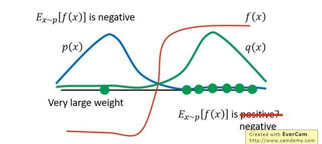

# On Policy To Off Policy

作者: CHUN-CHENG LIN
日期: 2024/07/19

---

## 定義

+ On policy: 學習的agent跟與環境互動的agent是同一個(自己玩自己學)
+ Off policy: 學習的agent跟與環境互動的agent是不同的(可以看別人玩得來學)

## 為什麼要用off policy

以policy gradient為例，policy gradient的梯度公式為:
$$\nabla \bar{R}_\theta = E_{\tau \sim p_\theta(\tau)}[R(\tau)\nabla\ln p_\theta(\tau)]$$agent $\pi_\theta$去與環境互動，只能從$\pi_\theta$輸出的distribution $p_\theta$中去sample $\tau$來調整 $\theta$，這樣的缺點是agent與環境互動完後，收集到的資料只能用來訓練一次就不能用了，要重新收集，是不太經濟的做法。
所以我們希望可以作到能利用$\pi_{\theta'}$的distribution sample出來的 $\tau$ 去訓練 $\theta$，如此就能實現保留資料再次利用於訓練 $\theta$。

## Importance Sampling

> 這是一個general的技巧，不僅限於RL領域

將式子通用化一點，$E_{x \sim p}[f(x)]$，也就是要從distribution $p$中sample出$x$帶入$f(x)$然後求期望值，假設我們不能對$p$這個distribution做積分，所以用sample的方式去逼近:
$$E_{x \sim p}[f(x)] \approx \frac{1}{N}\sum_{i = 1}^{N}f(x_i)$$假設現在給了一個限制，**我們不能從$p(x)$中sample，只能從$q(x)$中sample $x_i$**。
這裡用到期望值積分:
$$\begin{align}
    E_{x \sim p}[f(x)] 
    &= \int f(x)p(x) dx\\
    &= \int f(x)\frac{p(x)}{q(x)}q(x) dx\\
    &= E_{x \sim q}[f(x)\frac{p(x)}{q(x)}]
\end{align}$$說明:
1. $(1)$是期望值積分
2. $(1)\to(2)$是上下同乘$q(x)$
3. $(2)\to(3)$是將$f(x)\frac{p(x)}{q(x)}$看作一個函式，因此變成求從distribution $q(x)$中sample $x$帶入$f(x)\frac{p(x)}{q(x)}$求期望值

整理
$$E_{x \sim p}[f(x)] = E_{x \sim q}[f(x)\frac{p(x)}{q(x)}]$$所以即使不能從$p(x)$去sample資料也能利用$q(x)$去計算出$E_{x \sim p}[f(x)]$，所以由推導可知從$p(x)$與從$q(x)$sample計算distribution的期望值只相差一個weight，也就是$\frac{p(x)}{q(x)}$。
因此$q(x)$可以很隨意，只有小限制就是當在$q(x)$中機率是0的在$p(x)$中也必須是0，否則$\frac{p(x)}{q(x)}$沒有定義，反之$p(x)、q(x)$都是0有數學意義。

至此我們能夠基本無cost的方式轉換從$q(x)$而不是$p(x)$中去sample。

### Importance Sampling的Issue

$$E_{x \sim p}[f(x)] = E_{x \sim q}[f(x)\frac{p(x)}{q(x)}]$$雖然理論上$q(x)$可以很隨意，但是實際上$p(x)$與$q(x)$還是不能差異太大，推導出來$p(x)$與$q(x)$sample帶入$f(x)$的期望值只差一個weight，但是來看變異數$Var_{x \sim p}[f(x)]$與$Var_{x \sim q}[f(x)\frac{p(x)}{q(x)}]$會一樣嗎?
兩個random variable的mean(期望值)一樣，並不代表它們的Var會一樣，利用公式$Var(x) = E(x^2) - (E(x))^2$可以實際算算看:
$$Var_{x \sim p}[f(x)] = E_{x \sim p}[f(x)^2] - (E_{x \sim p}[f(x)])^2$$$$\begin{align*}
    Var_{x \sim q}[f(x)\frac{p(x)}{q(x)}] &= E_{x \sim q}[(f(x)\frac{p(x)}{q(x)})^2] - (E_{x \sim q}[f(x)\frac{p(x)}{q(x)}])^2\\
    &= E_{x \sim q}[f(x)^2\frac{p(x)^2}{q(x)^2}] - (E_{x \sim q}[f(x)\frac{p(x)}{q(x)}])^2\\
    &= E_{x \sim p}[f(x)^2\frac{p(x)^2}{q(x)^2}\frac{q(x)}{p(x)}] - (E_{x \sim q}[f(x)\frac{p(x)}{q(x)}])\\
    &= E_{x \sim p}[f(x)^2\frac{p(x)}{q(x)}] - (E_{x \sim p}[f(x)])^2
\end{align*}$$到這邊就能很明顯的看出$q(x)$與$p(x)$ Var是不一樣的。
這公式指出一個問題，若$p(x)$與$q(x)$的差距很大時，當sample夠多次時，$p(x)$與$q(x)$的期望值只差固定的weight，但是假設今天sample的不夠多，它們的Var就會有差距。

圖片取自 李宏毅老師 [網址](https://youtu.be/OAKAZhFmYoI?si=pBfkfzOSR79-ABvC&t=855)
綠線是$q(x)$的分布，藍線是$p(x)$的分布，紅線是$f(x)$，$p(x)$的sample多在左邊，$f(x)$為負，相對於$q(x)$的sample多會在右邊，$f(x)$為正，假設sample數夠多，由於$p(x)$分布偏左且$f(x) < 0$，所以$E_{x \sim p}[f(x)]$應該要是負的。
現在換成對$q(x)$做sample，倘若今天sample數很少，機率上很可能都sample在右邊，此時算出來的$E_{x \sim p}[f(x)]$是正的，但是如果現在終於sample到了一個在左邊的，由於$p(x)$比$q(x)$大的多，$\frac{p(x)}{q(x)}$算起來會很大，才有可能$E_{x \sim p}[f(x)]$變回負的。
所以當sample數很少的時候，$E_{x \sim p}[f(x)] = E_{x \sim q}[f(x)\frac{p(x)}{q(x)}]$就會變得等式一邊正一邊負，顯然等式不再成立。

## 應用到RL

這邊舉如何將policy gradient改成off policy的訓練方式:
$$\nabla\bar{R}_\theta = E_{\tau \sim p_\theta(\tau)}[R(\tau)\nabla\ln p_\theta(\tau)]$$現在改成對$p_{\theta'}$做sample:
$$\nabla\bar{R}_\theta = E_{\tau \sim p_{\theta'}(\tau)}[\frac{p_\theta(\tau)}{p_{\theta'}(\tau)} R(\tau)\nabla\ln p_\theta(\tau)]$$至此，我們找到一種方法將policy gradient中耗時的on policy限制轉換成可以在off policy的方式下訓練，由此可以延伸出許多policy gradient的改良演算法(ex: PPO)。
