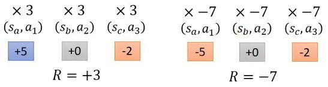
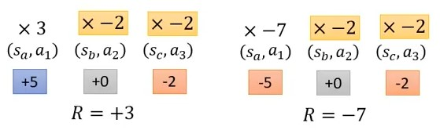
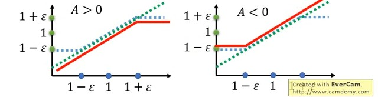

# Proximal Policy Optimization

作者: CHUN-CHENG LIN
日期: 2024/07/19

---

> 先備知識: on policy轉off policy的方法、importance sampling

## Policy gradient的問題

### 不同Action應該要給適合的Credit

原本的policy gradient加上baseline機制，梯度公式為:
$$\nabla \bar{R}_\theta = \frac{1}{N}\sum_{n = 1}^{N}\sum_{t = 1}^{T_n}(R(\tau^n) - b)\nabla\ln(p_\theta(a_t^n|s_t^n))$$這意味著在一場episode中所有的state與action的pair都會乘上相同的reward，這顯然有問題，因為一場episode若最後成果是不好的，並不代表episode裡每一個action都是不好的，一樣若episode最後結果是好的，這也不代表過程中每一個action都是不好的，所以其實應該要不同的action要乘上不同的weight，這樣才能利用weight去反應出action到底是好還是不好。

圖片取自 李宏毅老師 [網址](https://youtu.be/z95ZYgPgXOY?si=zDhOVHHkJVnL1_1n&t=2275)
假設現在一個episode都很短，三的action就結束了，看左邊的例子，最後得到3分，但可以看到即使在看到$s_3$採取$a_3$的選擇被扣了2分，卻仍是被乘上+3，右邊的例子也是，在看到$s_2$採取$a_2$的選擇可能不是不好的action，卻被乘上-7。
這個問題假設今天sample的夠多，這問題會因為看的夠多，統計下來不會有問題，但實務上往往sample不夠多，所以就應該給每個state action pair合理的credit，也就是要知道這個pair對分數的contribution。

圖片取自 李宏毅老師 [網址](https://youtu.be/z95ZYgPgXOY?si=zDhOVHHkJVnL1_1n)
一種解決方法是指乘上從這個pair之後的分數，因為從這個pair後的分數才純粹受到此pair的影響，在這個pair之前的影響就不被考慮，就像左邊的例子，過程中+5分並沒有($s_b$, $a_2$)的功勞，它真正有參與到的只有-2分，所以要將公式改為:
$$\nabla \bar{R}_\theta = \frac{1}{N}\sum_{n = 1}^{N}\sum_{t = 1}^{T_n}(\underbrace{R(\tau^n)} - b)\nabla\ln(p_\theta(a_t^n|s_t^n))$$括起來的部分要改成
$$\nabla \bar{R}_\theta = \frac{1}{N}\sum_{n = 1}^{N}\sum_{t = 1}^{T_n}(\underbrace{\sum_{t' = 1}^{T_n}r^n_{t'}} - b)\nabla\ln(p_\theta(a_t^n|s_t^n))$$然後會加入discount($\gamma < 1$)以減少未來的影響性:
$$\nabla \bar{R}_\theta = \frac{1}{N}\sum_{n = 1}^{N}\sum_{t = 1}^{T_n}(\underbrace{\sum_{t' = 1}^{T_n}\gamma^{t'-t} r^n_{t'}} - b)\nabla\ln(p_\theta(a_t^n|s_t^n))$$
但是實作上因為$b$很複雜，所以會用NN來決定:
$$\nabla \bar{R}_\theta = \frac{1}{N}\sum_{n = 1}^{N}\sum_{t = 1}^{T_n}(\underbrace{\sum_{t' = 1}^{T_n}\gamma^{t'-t} r^n_{t'} - b})\nabla\ln(p_\theta(a_t^n|s_t^n))$$變
$$\nabla \bar{R}_\theta = \frac{1}{N}\sum_{n = 1}^{N}\sum_{t = 1}^{T_n}\underbrace{A^\theta(s_t,a_t)}\nabla\ln(p_\theta(a_t^n|s_t^n))$$稱作"Advantage Function"，其意義是看到$s_t$後採取$a_t$這個action相較於其他action有多好，這是"Critic"的想法(以後AC才會介紹)。

### On Policy To Off Policy

到這邊已經知道要調整的梯度公式為:
$$\begin{align}
    &\nabla\bar{R}_\theta\nonumber
    &=E_{(s_t,a_t) \sim p_\theta}[A^\theta(s_t,a_t)\nabla\ln p_\theta(a_t^n|s_t^n)]\\
    &= E_{(s_t,a_t) \sim p_{\theta'}}[\frac{p_\theta(s_t,a_t)}{p_{\theta'}(s_t,a_t)} A^{\theta'}(s_t,a_t)\nabla\ln p_\theta(a_t^n|s_t^n)]\\
    &= E_{(s_t,a_t) \sim p_{\theta'}}[\frac{p_\theta(a_t|s_t)}{p_{\theta'}(a_t|s_t)}\underbrace{\frac{p_\theta(s_t)}{p_{\theta'}(s_t)}} A^{\theta'}(s_t,a_t)\nabla\ln p_\theta(a_t^n|s_t^n)]\\
    &\approx E_{(s_t,a_t) \sim p_{\theta'}}[\frac{p_\theta(a_t|s_t)}{p_{\theta'}(a_t|s_t)} A^{\theta'}(s_t,a_t)\nabla\ln p_\theta(a_t^n|s_t^n)]
\end{align}$$說明:
1. $(1)\to(2)$是從$p_\theta$改成從$p_{\theta'}$ sample的轉換(詳看importance sampling)
2. $(2)\to(3)$是將機率展開
3. $(3)\to(4)$是一個假設，假設$p_\theta(s_t)$與$p_{\theta'}(s_t)$是差不多的所以可以當作1，但是為什麼可以這樣假設，有兩個理由:
   + 如果今天state就是遊戲的畫面，基本上如果要遇到完全一樣的state幾乎不太可能，所以就假設NN $\theta$與NN $\theta'$看到$s_t$的機率是差不多一樣的
   + 另一個實際面的原因是$p_\theta(s_t)$與$p_{\theta'}(s_t)$很難算，所以就**相信**它們差不多

經過上面的推導，我們找到了新的Objective function:
利用最後求的gradient
$$E_{(s_t,a_t) \sim p_{\theta'}}[\frac{p_\theta(a_t|s_t)}{p_{\theta'}(a_t|s_t)} A^{\theta'}(s_t,a_t)\nabla\ln p_\theta(a_t^n|s_t^n)]$$以及公式$\nabla f(x) = f(x)\nabla\ln(f(x))$，gradient可以改寫成
$$E_{(s_t,a_t) \sim p_{\theta'}}[\frac{1}{p_{\theta'}(a_t|s_t)} A^{\theta'}(s_t,a_t) \nabla p_\theta(a_t^n|s_t^n)]$$然後對梯度做積分，就變成
$$J^{\theta'}(\theta) = E_{(s_t,a_t) \sim p_{\theta'}}[\frac{p_\theta(a_t^n|s_t^n)}{p_{\theta'}(a_t|s_t)} A^{\theta'}(s_t,a_t)]$$這就是新的Objective function，其中$J^{\theta'}(\theta)$意思是要optimize的參數，而真正去與environment互動的是$\theta'$，這此我們得到了off policy的Objective function，但是有個隱憂是importance sampling的限制中，$p_\theta$與$p_{\theta'}$不能差太多，而這就是PPO要改善的點。

## Proximal Policy Optimization (PPO)

### Add Constraint

PPO真正在做的事情是:
$$J^{\theta'}_{PPO}(\theta) = J^{\theta'}(\theta) - \beta KL(\theta,\theta')$$其中$KL$是KL divergence，是計算兩個機率分布相似度的方式，$KL(\theta,\theta')$的意思是給$\theta、\theta'$許多一不樣的state $s_i$，每個它們輸出的兩個distribution去計算平均KL divergence。

### PPO algorithm 1

1. 初始化policy參數 $\theta^0$
2. Foreach iteration
   1. 利用$\theta^k$去與environment互動並收集$(s_t,a_t)$以及計算advantage $A^{\theta^k}(s_t,a_t)$
   2. 找新的 $\theta$ 去optimize $J_{PPO}(\theta)$ (注: 會一次更新several times):
   $$J^{\theta^k}_{PPO}(\theta) = J^{\theta^k} - \beta KL(\theta,\theta')$$其中
   $$J^{\theta^k}(\theta) \approx \sum_{(s_t,a_t)}\frac{p_\theta(a_t|s_t)}{p_{\theta^k}(a_t|s_t)}A^{\theta^k}(s_t,a_t)$$
   3. If $KL(\theta,\theta') > KL_{max}$, increase $\beta$
   If $KL(\theta,\theta^k) < KL_{min}$, decrease $\beta$

而過程要計算$KL$時，輸入的states可以利用已經收集過的$(s_t, a_t)$，另外，動態調整$\beta$的過程稱作"Adaptive KL Penalty"。

### PPO algorithm 2

PPO的algorithm第一版中有KL divergence要算，可能變得麻煩，所以提出第二版的algorithm，裡面沒有KL divergence:
$$J^{\theta^k}_{PPO2}(\theta) \approx \sum_{(s_t,a_t)} \min (\frac{p_\theta(a_t|s_t)}{p_{\theta^k}(a_t|s_t)} A^{\theta^k}(s_t,a_t), \text{clip}(\frac{p_\theta(a_t|s_t)}{p_{\theta^k}(a_t|s_t)}, 1 - \epsilon, 1 + \epsilon) A^{\theta^k}(s_t,a_t))$$式子看起來很長，但相對來說實作簡單很多。
說明:
$\text{clip}(\frac{p_\theta(a_t|s_t)}{p_{\theta^k}(a_t|s_t)}, 1 - \epsilon, 1 + \epsilon) A^{\theta^k}(s_t,a_t)$這一項的意義

圖片取自 李宏毅老師 [網址](https://youtu.be/OAKAZhFmYoI?si=gxlb4R19W7sb7qJ2&t=2307)
橫軸是$\frac{p_\theta(a_t|s_t)}{p_{\theta^k}(a_t|s_t)}$，綠色的線是$\frac{p_\theta(a_t|s_t)}{p_{\theta^k}(a_t|s_t)} A^{\theta^k}(s_t,a_t)$，今天當$A>0$時，會希望提升發生的機率(也就是$p_\theta(a_t|s_t)$)，反之$A<0$要減少發生的機率，套入公式取min以後就是紅色的線，而公式的作用是增加$p_\theta(a_t|s_t)$的同時不要增加太多，否則與$p_{\theta^k}(a_t|s_t)$的差距變大太多(要求不超過$1 + \epsilon$)，反之減少的case也是一樣的想法。
