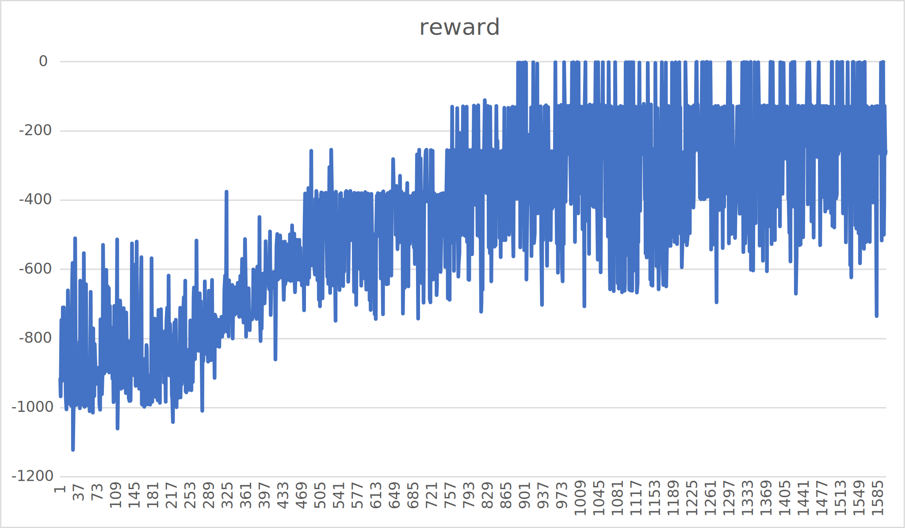

# Proximal Policy Optimization(連續動作空間)

作者: CHUN-CHENG LIN
日期: 2024/07/24

---

> 先備知識: PPO離散動作空間，如果尚未了解可以先前往 "RL-PPO 離散動作空間"

> 這會是一篇短篇幅的文章

## 與離散動作空間的不同

其實連續動作空間與離散空間的背景原理大同小異，只是離散動作空間可以枚舉下一個action，所以實作上可以將ActorNN(or say PolicyNN)設計成分類型NN，但是在連續空間中沒辦法枚舉action，因此變成只能用類似回歸模型的方式去預測下個動作，但要預測什麼值也是一個問題，在論文的解法中是利用normal distribution去sample action的值，而ActorNN目標就是學習預測normal distribution的$\mu、\sigma$(平均數、標準差)，我們在利用NN輸出的$\mu、\sigma$來建立normal distribution，以此解決動作空間無限大的問題。

## 小議題

在一些任務中，可能會需要同時幾個動作輸入給agent，如$A = [a_1, a_2] = [2.4, 3.5]$代表個水平移動2.4單位且垂直移動3.5單位，我們直覺上會認為兩個action可能有相互依賴的關係，但是應該要兩個動作分開選擇還是應該依照一定的關係選擇，這兩種實作方法似乎還沒有一個結論。

## 實驗-Pendulum-v1

### 實驗程式碼介紹

先定義超參數

```py
# ARG.py

gamma = 0.95
Clip_Ratio = 0.2 # 習慣設成0.2

Actor_lr = 0.0003

Critic_lr = 0.0003

NN_Update_Per_Epoch = 10

Max_Timesteps_Per_Episode = 128
Max_Timesteps_Per_Batch = 1024

BatchSize = 64
```

定義存遊戲過程參數的Buffer

```py
# Buffer.py
class Buffer:
    def __init__(self):
        self.states = []
        self.actions = []
        self.nextStates = []
        self.rewards = []
        self.dones = []
        self.log_probs = []
        self.batchLens = []
    def clear(self):
        self.states.clear()
        self.actions.clear()
        self.nextStates.clear()
        self.rewards.clear()
        self.dones.clear()
        self.log_probs.clear()
        self.batchLens.clear()
```

定義ActorNN

```py
# ActorNN.py
import torch

class ActorNN(torch.nn.Module):
    def __init__(self, inDim, bound):
        super().__init__()
        self.bound = bound
        
        self.l1 = torch.nn.Linear(inDim, 32)
        self.relu1 = torch.nn.ReLU()
        self.mu_out = torch.nn.Linear(32, 1)
        self.tanh1 = torch.nn.Tanh()
        self.sigma_out = torch.nn.Linear(32, 1)
        self.softplus1 = torch.nn.Softplus()
    def forward(self, x):
        out = self.l1(x)
        out = self.relu1(out)
        mu = self.mu_out(out)
        mu = self.bound * self.tanh1(mu)
        # sigma為正，所以要套一個類似relu的activation
        sigma = self.sigma_out(out)
        sigma = self.softplus1(sigma)
        return mu, sigma
```

目標是輸出$\mu、\sigma$，但是遊戲中動作被限制在$[-2.0,2.0]$之間，所以$\mu$的範圍就會有限制了，解法是套上tanh，將NN輸出限制在$[-1.0, 1.0]$，乘上2.0即可將輸出縮放到$[-2.0, 2.0]$，還有$\sigma$的輸出，$\sigma$不可能$<0$，所以用類似ReLU的softplus將$\sigma$限制在大於$0$。

定義CriticNN

```py
# CriticNN
import torch

class CriticNN(torch.nn.Module):
    def __init__(self, inDim):
        super().__init__()
        self.l1 = torch.nn.Linear(inDim, 16)
        self.relu1 = torch.nn.ReLU()
        self.l2 = torch.nn.Linear(16, 1)
    def forward(self, x):
        out = self.l1(x)
        out = self.relu1(out)
        out = self.l2(out)
        return out
```

就是一個簡單的regression模型

整合ActorNN與CriticNN變PPO

```py
# PPO.py
from CriticNN import CriticNN
from ActorNN import ActorNN
import torch

import ARG

class PPO:
    def __init__(self, stateDim, bound, device):
        self.device = device
        self.bound = bound
        self.actor = ActorNN(stateDim, bound).to(self.device)
        self.critic = CriticNN(stateDim).to(self.device)
        
        self.actorOptimizer = torch.optim.Adam(self.actor.parameters(), ARG.Actor_lr)
        self.criticOptimizer = torch.optim.Adam(self.critic.parameters(), ARG.Critic_lr)
        
    def selectAction(self, state):
        mu, sigma = self.actor(state)
        distribution = torch.distributions.Normal(mu, sigma)
        action = distribution.sample()
        log_prob = distribution.log_prob(action)
        # 不能超過遊戲的限制範圍
        action.clamp(-self.bound, self.bound)
        return action.item(), log_prob
    
    def save(self):
        torch.save(self.actor.state_dict(), "actorModel.pth")
        torch.save(self.critic.state_dict(), "criticModel.pth")
        
    def load(self, actorModelPath: str, criticModelPath: str):
        loaded = torch.load(actorModelPath)
        self.actor.load_state_dict(loaded)
        loaded = torch.load(criticModelPath)
        self.critic.load_state_dict(loaded)
```

與離散動作空間不一樣的地方:

```py
def selectAction(self, state):
    mu, sigma = self.actor(state)
    distribution = torch.distributions.Normal(mu, sigma)
    action = distribution.sample()
    log_prob = distribution.log_prob(action)
    # 不能超過遊戲的限制範圍
    action.clamp(-self.bound, self.bound)
    return action.item(), log_prob
```

要用的是normal distribution，然後最後還是要clamp以防止輸出超過限制範圍

定義Env

```py
import gym
import numpy as np
import torch
import matplotlib.pyplot as plt
from matplotlib import animation

from Buffer import Buffer
from PPO import PPO
from Logger import Logger
import ARG

def saveFramesToGif(frames, gifPath):
    patch = plt.imshow(frames[0])
    plt.axis("off")
    
    def animate(i):
        patch.set_data(frames[i])
    
    anim = animation.FuncAnimation(plt.gcf(), animate, frames = len(frames))
    anim.save(gifPath, writer = "ffmpeg", fps = 30)

class Env:
    def __init__(self, device, gameName: str, renderMode = "human"):
        self.env = gym.make(gameName, render_mode = renderMode)
        self.history = {
            "reward": []
        }
        self.device = device
        self.batchBuffer = Buffer()
        self.logger = Logger()
    
    def runBatchEpisode(self, agent: PPO):
        self.batchBuffer.clear()
        ep_totalRewards = []
        t = 0
        while (t < ARG.Max_Timesteps_Per_Batch):
            ep_rewards = []
            # 原始reward的list
            ep_ori_rewards = []
            state = self.env.reset()[0]
            done = False
            
            for ep_t in range(0, ARG.Max_Timesteps_Per_Episode):
                t += 1
                stateTensor = torch.tensor(state, dtype = torch.float32).unsqueeze(0).to(self.device)
                action, log_prob = agent.selectAction(stateTensor)
                nextState, reward, done, _, _ = self.env.step([action])
                self.batchBuffer.states.append(state)
                self.batchBuffer.actions.append(action)
                self.batchBuffer.log_probs.append(log_prob)
                self.batchBuffer.dones.append(done)
                ep_rewards.append((reward + 8) / 8)
                ep_ori_rewards.append(reward)
                if (done):
                    break
                if (t >= ARG.Max_Timesteps_Per_Batch):
                    break
                state = nextState
                
            self.batchBuffer.batchLens.append(ep_t + 1)
            self.batchBuffer.rewards.append(ep_rewards)
            ep_totalRewards.append(sum(ep_ori_rewards))
            self.logger.history["reward"].append(sum(ep_ori_rewards))
        return ep_totalRewards
    
    def computeDiscountedRewards(self, batchRewards):
        batchDiscountedRewards = []
        for epRewards in batchRewards[::-1]:
            discountedReward = 0
            for reward in epRewards[::-1]:
                discountedReward = reward + ARG.gamma * discountedReward
                batchDiscountedRewards.append(discountedReward)
        batchDiscountedRewards.reverse()
        return batchDiscountedRewards
    
    def train(self, agent: PPO, totalTimesteps: int):
        currTimesteps = 0
        while (currTimesteps < totalTimesteps):
            ep_totalRewards = self.runBatchEpisode(agent)
            
            currTimesteps += sum(self.batchBuffer.batchLens)
            self.logger["currTimesteps"] = currTimesteps
            self.logger["meanEpisodeLen"] = sum(self.batchBuffer.batchLens) / len(self.batchBuffer.batchLens)
            self.logger["meanEpisodeReward"] = sum(ep_totalRewards) / len(ep_totalRewards)
            
            batchStates = torch.tensor(self.batchBuffer.states, dtype = torch.float32).to(self.device)
            batchActions = torch.tensor(self.batchBuffer.actions).reshape(-1, 1).to(self.device)
            batchLogProbs = torch.tensor(self.batchBuffer.log_probs, dtype = torch.float32).reshape(-1, 1).to(self.device)
            
            batchDiscountedRewards = self.computeDiscountedRewards(self.batchBuffer.rewards)
            batchDiscountedRewards = torch.tensor(batchDiscountedRewards, dtype = torch.float32).to(self.device)
            
            V = agent.critic(batchStates).squeeze()
            # advantages
            A_k = batchDiscountedRewards - V.detach()
            # 標準化優化(幫助收斂，非必要)
            A_k = (A_k - A_k.mean()) / (A_k.std() + 1e-9)
            batchDiscountedRewards = batchDiscountedRewards.reshape(-1, 1)
            A_k = A_k.reshape(-1, 1)
            
            # mini-batch
            step = batchStates.size(0)
            indexes = np.arange(step)
            minibarchSize = step // ARG.BatchSize
            # 一次訓練某些次數次
            for _ in range(ARG.NN_Update_Per_Epoch):
                np.random.shuffle(indexes)
                for start in range(0, step, minibarchSize):
                    end = start + minibarchSize
                    idx = indexes[start:end]
                    miniStates = batchStates[idx]
                    miniActions = batchActions[idx]
                    miniLogProbs = batchLogProbs[idx]
                    miniAdvantage = A_k[idx]
                    miniDiscountedRewards = batchDiscountedRewards[idx]
                    V = agent.critic(miniStates)
                    mu, sigma = agent.actor(miniStates)
                    log_probs = torch.distributions.Normal(mu, sigma).log_prob(miniActions.detach())
                    log_probs = log_probs.reshape(-1, 1)
                    # PPO演算法裡的 pi_theta(a_t|s_t) / pi_theta_k(a_t | s_t)
                    # 因為log所以除法變減法
                    ratios = torch.exp(log_probs - miniLogProbs)
                    # PPO演算法精隨: clamp
                    loss1 = ratios * miniAdvantage
                    loss2 = torch.clamp(ratios, 1 - ARG.Clip_Ratio, 1 + ARG.Clip_Ratio) * miniAdvantage
                    actorLoss = (-torch.min(loss1, loss2)).mean()
                    # critic用MSE loss即可
                    criticLoss = torch.nn.MSELoss()(V, miniDiscountedRewards)
                
                    agent.actorOptimizer.zero_grad()
                    actorLoss.backward()
                    agent.actorOptimizer.step()

                    agent.criticOptimizer.zero_grad()
                    criticLoss.backward()
                    agent.criticOptimizer.step()
            
            self.logger.log()
            
        self.logger.saveHistory()
        self.env.close()
        
    def evaluate(self, agent: PPO):
        frames = []
        currTimesteps = 0
        state = self.env.reset()[0]
        while (currTimesteps < 1000):
            currTimesteps += 1
            frames.append(self.env.render())
            self.env.render()
            state = torch.tensor(state, dtype = torch.float).unsqueeze(0).to(self.device)
            action, _ = agent.selectAction(state)
            nextState, reward, done, _, _ = self.env.step([action])
            if (done):
                break
            state = nextState
        self.env.close()
        saveFramesToGif(frames, "./evaluate.gif")

    @property
    def actionDim(self):
        return self.env.action_space.n

    @property
    def stateDim(self):
        return self.env.observation_space.shape[0]
```

其中需要特別講的地方是:

```py
ep_rewards.append((reward + 8) / 8)
```

在實驗中我沒有用原本的reward，而是用(reward + 8) / 8，主要原因是Pendulum-v1的設計reward是以懲罰的角度設計的，原本reward function公式: $r = -(theta^2 + 0.1 * theta_{dt}^2 + 0.001 * torque^2)$，範圍是$[-(pi^2 + 0.1 * 82 + 0.001 * 22) = -16.2736044, 0.0]$，因此目標還是最大化reward總和(也就是最大$0$)，也可看作最小化懲罰，這導致reward都是負的，而在PPO中比較希望reward是有正有負，所以在參考網路上以及思考後決定將reward加上一半(也就是8)，如此reward就可以有正有負，除以8的主要原因是將reward縮小一點，Critic在預測時範圍小比較好收斂。

> 注: 我有實驗過直接用原本的reward，訓練完會發現與沒訓練差不多

實驗的Python entrypoint

```py
# demo.py
from Env import Env
from PPO import PPO
import torch

if __name__ == "__main__":
    device = torch.device("cuda:0" if torch.cuda.is_available() else "cpu")
    
    env = Env(device, "Pendulum-v1", "rgb_array")
    agent = PPO(env.stateDim, 2, device)
    env.train(agent, 204800)
    agent.save()
```

### 實驗結果


可以看到過程是慢慢上升，雖然學習的不快但至少算是穩定，最後越來越能達到$0$扣分。

驗證發現可以順利的"甩"上去。

## Reference

[https://iclr-blog-track.github.io/2022/03/25/ppo-implementation-details/](https://iclr-blog-track.github.io/2022/03/25/ppo-implementation-details/)
