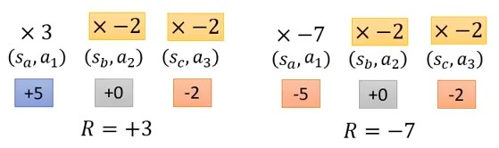

# Proximal Policy Optimization(離散動作空間)

作者: CHUN-CHENG LIN
日期: 2024/07/19

---

> 先備知識: on policy轉off policy的方法、importance sampling

## Policy gradient的問題

### 不同Action應該要給適合的Credit

原本的policy gradient加上baseline機制，梯度公式為:
$$\nabla \bar{R}_\theta = \frac{1}{N}\sum_{n = 1}^{N}\sum_{t = 1}^{T_n}(R(\tau^n) - b)\nabla\ln(p_\theta(a_t^n|s_t^n))$$這意味著在一場episode中所有的state與action的pair都會乘上相同的reward，這顯然有問題，因為一場episode若最後成果是不好的，並不代表episode裡每一個action都是不好的，一樣若episode最後結果是好的，這也不代表過程中每一個action都是不好的，所以其實應該要不同的action要乘上不同的weight，這樣才能利用weight去反應出action到底是好還是不好。

圖片取自 李宏毅老師 [網址](https://youtu.be/z95ZYgPgXOY?si=zDhOVHHkJVnL1_1n&t=2275)
假設現在一個episode都很短，三的action就結束了，看左邊的例子，最後得到3分，但可以看到即使在看到$s_3$採取$a_3$的選擇被扣了2分，卻仍是被乘上+3，右邊的例子也是，在看到$s_2$採取$a_2$的選擇可能不是不好的action，卻被乘上-7。
這個問題假設今天sample的夠多，這問題會因為看的夠多，統計下來不會有問題，但實務上往往sample不夠多，所以就應該給每個state action pair合理的credit，也就是要知道這個pair對分數的contribution。

圖片取自 李宏毅老師 [網址](https://youtu.be/z95ZYgPgXOY?si=zDhOVHHkJVnL1_1n)
一種解決方法是指乘上從這個pair之後的分數，因為從這個pair後的分數才純粹受到此pair的影響，在這個pair之前的影響就不被考慮，就像左邊的例子，過程中+5分並沒有($s_b$, $a_2$)的功勞，它真正有參與到的只有-2分，所以要將公式改為:
$$\nabla \bar{R}_\theta = \frac{1}{N}\sum_{n = 1}^{N}\sum_{t = 1}^{T_n}(\underbrace{R(\tau^n)} - b)\nabla\ln(p_\theta(a_t^n|s_t^n))$$括起來的部分要改成
$$\nabla \bar{R}_\theta = \frac{1}{N}\sum_{n = 1}^{N}\sum_{t = 1}^{T_n}(\underbrace{\sum_{t' = 1}^{T_n}r^n_{t'}} - b)\nabla\ln(p_\theta(a_t^n|s_t^n))$$然後會加入discount($\gamma < 1$)以減少未來的影響性:
$$\nabla \bar{R}_\theta = \frac{1}{N}\sum_{n = 1}^{N}\sum_{t = 1}^{T_n}(\underbrace{\sum_{t' = 1}^{T_n}\gamma^{t'-t} r^n_{t'}} - b)\nabla\ln(p_\theta(a_t^n|s_t^n))$$
但是實作上因為$b$很複雜，所以會用NN來決定:
$$\nabla \bar{R}_\theta = \frac{1}{N}\sum_{n = 1}^{N}\sum_{t = 1}^{T_n}(\underbrace{\sum_{t' = 1}^{T_n}\gamma^{t'-t} r^n_{t'} - b})\nabla\ln(p_\theta(a_t^n|s_t^n))$$變
$$\nabla \bar{R}_\theta = \frac{1}{N}\sum_{n = 1}^{N}\sum_{t = 1}^{T_n}\underbrace{A^\theta(s_t,a_t)}\nabla\ln(p_\theta(a_t^n|s_t^n))$$稱作"Advantage Function"，其意義是看到$s_t$後採取$a_t$這個action相較於其他action有多好，這是"Critic"的想法(以後AC才會介紹)。

### On Policy To Off Policy

到這邊已經知道要調整的梯度公式為:
$$\begin{align}
    &\nabla\bar{R}_\theta\nonumber\\
    &=E_{(s_t,a_t) \sim p_\theta}[A^\theta(s_t,a_t)\nabla\ln p_\theta(a_t^n|s_t^n)]\\
    &= E_{(s_t,a_t) \sim p_{\theta'}}[\frac{p_\theta(s_t,a_t)}{p_{\theta'}(s_t,a_t)} A^{\theta'}(s_t,a_t)\nabla\ln p_\theta(a_t^n|s_t^n)]\\
    &= E_{(s_t,a_t) \sim p_{\theta'}}[\frac{p_\theta(a_t|s_t)}{p_{\theta'}(a_t|s_t)}\underbrace{\frac{p_\theta(s_t)}{p_{\theta'}(s_t)}} A^{\theta'}(s_t,a_t)\nabla\ln p_\theta(a_t^n|s_t^n)]\\
    &\approx E_{(s_t,a_t) \sim p_{\theta'}}[\frac{p_\theta(a_t|s_t)}{p_{\theta'}(a_t|s_t)} A^{\theta'}(s_t,a_t)\nabla\ln p_\theta(a_t^n|s_t^n)]
\end{align}$$說明:
1. $(1)\to(2)$是從$p_\theta$改成從$p_{\theta'}$ sample的轉換(詳看importance sampling)
2. $(2)\to(3)$是將機率展開
3. $(3)\to(4)$是一個假設，假設$p_\theta(s_t)$與$p_{\theta'}(s_t)$是差不多的所以可以當作1，但是為什麼可以這樣假設，有兩個理由:
   + 如果今天state就是遊戲的畫面，基本上如果要遇到完全一樣的state幾乎不太可能，所以就假設NN $\theta$與NN $\theta'$看到$s_t$的機率是差不多一樣的
   + 另一個實際面的原因是$p_\theta(s_t)$與$p_{\theta'}(s_t)$很難算，所以就**相信**它們差不多

經過上面的推導，我們找到了新的Objective function:
利用最後求的gradient
$$E_{(s_t,a_t) \sim p_{\theta'}}[\frac{p_\theta(a_t|s_t)}{p_{\theta'}(a_t|s_t)} A^{\theta'}(s_t,a_t)\nabla\ln p_\theta(a_t^n|s_t^n)]$$以及公式$\nabla f(x) = f(x)\nabla\ln(f(x))$，gradient可以改寫成
$$E_{(s_t,a_t) \sim p_{\theta'}}[\frac{1}{p_{\theta'}(a_t|s_t)} A^{\theta'}(s_t,a_t) \nabla p_\theta(a_t^n|s_t^n)]$$然後對梯度做積分，就變成
$$J^{\theta'}(\theta) = E_{(s_t,a_t) \sim p_{\theta'}}[\frac{p_\theta(a_t^n|s_t^n)}{p_{\theta'}(a_t|s_t)} A^{\theta'}(s_t,a_t)]$$這就是新的Objective function，其中$J^{\theta'}(\theta)$意思是要optimize的參數，而真正去與environment互動的是$\theta'$，這此我們得到了off policy的Objective function，但是有個隱憂是importance sampling的限制中，$p_\theta$與$p_{\theta'}$不能差太多，而這就是PPO要改善的點。

## Proximal Policy Optimization (PPO)

### Add Constraint

PPO真正在做的事情是:
$$J^{\theta'}_{PPO}(\theta) = J^{\theta'}(\theta) - \beta KL(\theta,\theta')$$其中$KL$是KL divergence，是計算兩個機率分布相似度的方式，$KL(\theta,\theta')$的意思是給$\theta、\theta'$許多一不樣的state $s_i$，每個它們輸出的兩個distribution去計算平均KL divergence。

### PPO algorithm 1

1. 初始化policy參數 $\theta^0$
2. Foreach iteration
   1. 利用$\theta^k$去與environment互動並收集$(s_t,a_t)$以及計算advantage $A^{\theta^k}(s_t,a_t)$
   2. 找新的 $\theta$ 去optimize $J_{PPO}(\theta)$ (注: 會一次更新several times):
   $$J^{\theta^k}_{PPO}(\theta) = J^{\theta^k} - \beta KL(\theta,\theta')$$其中
   $$J^{\theta^k}(\theta) \approx \sum_{(s_t,a_t)}\frac{p_\theta(a_t|s_t)}{p_{\theta^k}(a_t|s_t)}A^{\theta^k}(s_t,a_t)$$
   3. If $KL(\theta,\theta') > KL_{max}$, increase $\beta$
   If $KL(\theta,\theta^k) < KL_{min}$, decrease $\beta$

而過程要計算$KL$時，輸入的states可以利用已經收集過的$(s_t, a_t)$，另外，動態調整$\beta$的過程稱作"Adaptive KL Penalty"。

### PPO algorithm 2

PPO的algorithm第一版中有KL divergence要算，可能變得麻煩，所以提出第二版的algorithm，裡面沒有KL divergence:
$$J^{\theta^k}_{PPO2}(\theta) \approx \sum_{(s_t,a_t)} \min (\frac{p_\theta(a_t|s_t)}{p_{\theta^k}(a_t|s_t)} A^{\theta^k}(s_t,a_t), \text{clip}(\frac{p_\theta(a_t|s_t)}{p_{\theta^k}(a_t|s_t)}, 1 - \epsilon, 1 + \epsilon) A^{\theta^k}(s_t,a_t))$$式子看起來很長，但相對來說實作簡單很多。
說明:
$\text{clip}(\frac{p_\theta(a_t|s_t)}{p_{\theta^k}(a_t|s_t)}, 1 - \epsilon, 1 + \epsilon) A^{\theta^k}(s_t,a_t)$這一項的意義

圖片取自 李宏毅老師 [網址](https://youtu.be/OAKAZhFmYoI?si=gxlb4R19W7sb7qJ2&t=2307)
橫軸是$\frac{p_\theta(a_t|s_t)}{p_{\theta^k}(a_t|s_t)}$，綠色的線是$\frac{p_\theta(a_t|s_t)}{p_{\theta^k}(a_t|s_t)} A^{\theta^k}(s_t,a_t)$，今天當$A>0$時，會希望提升發生的機率(也就是$p_\theta(a_t|s_t)$)，反之$A<0$要減少發生的機率，套入公式取min以後就是紅色的線，而公式的作用是增加$p_\theta(a_t|s_t)$的同時不要增加太多，否則與$p_{\theta^k}(a_t|s_t)$的差距變大太多(要求不超過$1 + \epsilon$)，反之減少的case也是一樣的想法。

## 實驗

一樣利用OpenAI cartpole v1作為第一個小實驗:

先定義一些超參數

```py
# ARG.py
gamma = 0.99
Clip_Ratio = 0.2 # 習慣設成0.2

Policy_lr = 0.0003

Vaule_lr = 0.0003

NN_Update_Per_Epoch = 10

Max_Timesteps_Per_Episode = 1024
Max_Timesteps_Per_Batch = 2048

BatchSize = 64
```

定義PPO的Actor NN

```py
# PolicyNN.py
import torch

class PolicyNN(torch.nn.Module):
    def __init__(self, inDim, outDim):
        super().__init__()
        self.l1 = torch.nn.Linear(inDim, 16)
        self.relu1 = torch.nn.ReLU()
        self.l2 = torch.nn.Linear(16, outDim)
        self.softmax = torch.nn.Softmax(dim = 1)
    def forward(self, x):
        out = self.l1(x)
        out = self.relu1(out)
        out = self.l2(out)
        out = self.softmax(out)
        return out
```

定義PPO的Critic

```py
# VauleNN.py
import torch

class ValueNN(torch.nn.Module):
    def __init__(self, inDim):
        super().__init__()
        self.l1 = torch.nn.Linear(inDim, 16)
        self.relu1 = torch.nn.ReLU()
        self.l2 = torch.nn.Linear(16, 1)
    def forward(self, x):
        out = self.l1(x)
        out = self.relu1(out)
        out = self.l2(out)
        return out
```

整合兩個NN變成PPO，主要是利用ActorNN輸出每個動作的機率然後用機率分布去sample動作

```py
# PPO.py
from ValueNN import ValueNN
from PolicyNN import PolicyNN
import torch

import ARG

class PPO:
    def __init__(self, stateDim, actionDim, device):
        self.device = device
        self.actor = PolicyNN(stateDim, actionDim).to(self.device)
        self.critic = ValueNN(stateDim).to(self.device)
        
        self.actorOptimizer = torch.optim.Adam(self.actor.parameters(), ARG.Policy_lr)
        self.criticOptimizer = torch.optim.Adam(self.critic.parameters(), ARG.Vaule_lr)
        
    def selectAction(self, state):
        prob = self.actor(state)
        distribution = torch.distributions.Categorical(prob)
        action = distribution.sample()
        return action.item(), distribution.log_prob(action)
    
    def save(self):
        torch.save(self.actor.state_dict(), "actorModel.pth")
        torch.save(self.critic.state_dict(), "criticModel.pth")
        
    def load(self, actorModelPath: str, criticModelPath: str):
        loaded = torch.load(actorModelPath)
        self.actor.load_state_dict(loaded)
        loaded = torch.load(criticModelPath)
        self.critic.load_state_dict(loaded)
```

訓練時會用到的Buffer

```py
# Buffer.py

class Buffer:
    def __init__(self):
        self.states = []
        self.actions = []
        self.nextStates = []
        self.rewards = []
        self.dones = []
        self.log_probs = []
        self.batchLens = []
    def clear(self):
        self.states.clear()
        self.actions.clear()
        self.nextStates.clear()
        self.rewards.clear()
        self.dones.clear()
        self.log_probs.clear()
        self.batchLens.clear()
```

然後是最主要的Env:

```py
import gym
import numpy as np
import torch
import csv
import matplotlib.pyplot as plt
from matplotlib import animation

from Buffer import Buffer
from PPO import PPO
from Logger import Logger
import ARG

def saveFramesToGif(frames, gifPath):
    patch = plt.imshow(frames[0])
    plt.axis("off")
    
    def animate(i):
        patch.set_data(frames[i])
    
    anim = animation.FuncAnimation(plt.gcf(), animate, frames = len(frames))
    anim.save(gifPath, writer = "ffmpeg", fps = 30)

class Env:
    def __init__(self, device, gameName: str, renderMode = "human"):
        self.env = gym.make(gameName, render_mode = renderMode)
        self.history = {
            "reward": []
        }
        self.device = device
        self.batchBuffer = Buffer()
        self.logger = Logger()
    
    def runBatchEpisode(self, agent: PPO):
        self.batchBuffer.clear()
        ep_totalRewards = []
        t = 0
        while (t < ARG.Max_Timesteps_Per_Batch):
            ep_rewards = []
            state = self.env.reset()[0]
            done = False
            
            for ep_t in range(0, ARG.Max_Timesteps_Per_Episode):
                t += 1
                stateTensor = torch.tensor(state, dtype = torch.float32).unsqueeze(0).to(self.device)
                action, log_prob = agent.selectAction(stateTensor)
                nextState, reward, done, _, _ = self.env.step(action)
                self.batchBuffer.states.append(state)
                self.batchBuffer.actions.append(action)
                self.batchBuffer.log_probs.append(log_prob)
                self.batchBuffer.dones.append(done)
                ep_rewards.append(reward)
                if (done):
                    break
                if (t >= ARG.Max_Timesteps_Per_Batch):
                    break
                state = nextState
                
            self.batchBuffer.batchLens.append(ep_t + 1)
            self.batchBuffer.rewards.append(ep_rewards)
            ep_totalRewards.append(sum(ep_rewards))
            self.logger.history["reward"].append(sum(ep_rewards))
        return ep_totalRewards
    
    def computeDiscountedRewards(self, batchRewards):
        batchDiscountedRewards = []
        for epRewards in batchRewards[::-1]:
            discountedReward = 0
            for reward in epRewards[::-1]:
                discountedReward = reward + ARG.gamma * discountedReward
                batchDiscountedRewards.append(discountedReward)
        batchDiscountedRewards.reverse()
        return batchDiscountedRewards
    
    def train(self, agent: PPO, totalTimesteps: int):
        currTimesteps = 0
        while (currTimesteps < totalTimesteps):
            ep_totalRewards = self.runBatchEpisode(agent)
            
            currTimesteps += sum(self.batchBuffer.batchLens)
            self.logger["currTimesteps"] = currTimesteps
            self.logger["meanEpisodeLen"] = sum(self.batchBuffer.batchLens) / len(self.batchBuffer.batchLens)
            self.logger["meanEpisodeReward"] = sum(ep_totalRewards) / len(ep_totalRewards)
            
            batchStates = torch.tensor(self.batchBuffer.states, dtype = torch.float32).to(self.device)
            batchActions = torch.tensor(self.batchBuffer.actions).reshape(-1, 1).to(self.device)
            batchLogProbs = torch.tensor(self.batchBuffer.log_probs, dtype = torch.float32).reshape(-1, 1).to(self.device)
            
            batchDiscountedRewards = self.computeDiscountedRewards(self.batchBuffer.rewards)
            batchDiscountedRewards = torch.tensor(batchDiscountedRewards, dtype = torch.float32).to(self.device)
            
            V = agent.critic(batchStates).squeeze()
            # advantages
            A_k = batchDiscountedRewards - V.detach()
            # 標準化優化(幫助收斂，非必要)
            A_k = (A_k - A_k.mean()) / (A_k.std() + 1e-9)
            batchDiscountedRewards = batchDiscountedRewards.reshape(-1, 1)
            A_k = A_k.reshape(-1, 1)
            
            # # 一次訓練某些次數次
            # for _ in range(ARG.NN_Update_Per_Epoch):
            #     V = agent.critic(batchStates)
            #     probs = agent.actor(batchStates)
            #     log_probs = torch.distributions.Categorical(probs).log_prob(batchActions.detach().squeeze())
            #     log_probs = log_probs.reshape(-1, 1)
                
            #     # PPO演算法裡的 pi_theta(a_t|s_t) / pi_theta_k(a_t | s_t)
            #     # 因為log所以除法變減法
            #     ratios = torch.exp(log_probs - batchLogProbs)
            #     # PPO演算法精隨: clamp
            #     loss1 = ratios * A_k
            #     loss2 = torch.clamp(ratios, 1 - ARG.Clip_Ratio, 1 + ARG.Clip_Ratio) * A_k
            #     actorLoss = (-torch.min(loss1, loss2)).mean()
            #     # critic用MSE loss即可
            #     criticLoss = torch.nn.MSELoss()(V, batchDiscountedRewards)
                
            #     agent.actorOptimizer.zero_grad()
            #     actorLoss.backward()
            #     agent.actorOptimizer.step()
                
            #     agent.criticOptimizer.zero_grad()
            #     criticLoss.backward()
            #     agent.criticOptimizer.step()
            
            # mini-batch
            step = batchStates.size(0)
            indexes = np.arange(step)
            minibarchSize = step // ARG.BatchSize
            # 一次訓練某些次數次
            for _ in range(ARG.NN_Update_Per_Epoch):
                np.random.shuffle(indexes)
                for start in range(0, step, minibarchSize):
                    end = start + minibarchSize
                    idx = indexes[start:end]
                    miniStates = batchStates[idx]
                    miniActions = batchActions[idx]
                    miniLogProbs = batchLogProbs[idx]
                    miniAdvantage = A_k[idx]
                    miniDiscountedRewards = batchDiscountedRewards[idx]
                    V = agent.critic(miniStates)
                    probs = agent.actor(miniStates)
                    log_probs = torch.distributions.Categorical(probs).log_prob(miniActions.detach().squeeze())
                    log_probs = log_probs.reshape(-1, 1)
                    # PPO演算法裡的 pi_theta(a_t|s_t) / pi_theta_k(a_t | s_t)
                    # 因為log所以除法變減法
                    ratios = torch.exp(log_probs - miniLogProbs)
                    # PPO演算法精隨: clamp
                    loss1 = ratios * miniAdvantage
                    loss2 = torch.clamp(ratios, 1 - ARG.Clip_Ratio, 1 + ARG.Clip_Ratio) * miniAdvantage
                    actorLoss = (-torch.min(loss1, loss2)).mean()
                    # critic用MSE loss即可
                    criticLoss = torch.nn.MSELoss()(V, miniDiscountedRewards)
                
                    agent.actorOptimizer.zero_grad()
                    actorLoss.backward()
                    agent.actorOptimizer.step()

                    agent.criticOptimizer.zero_grad()
                    criticLoss.backward()
                    agent.criticOptimizer.step()
            
            self.logger.log()
            
        self.logger.saveHistory()
        self.env.close()
        
    def evaluate(self, agent: PPO):
        frames = []
        currTimesteps = 0
        state = self.env.reset()[0]
        while (currTimesteps < 1000):
            currTimesteps += 1
            frames.append(self.env.render())
            state = torch.tensor(state, dtype = torch.float).unsqueeze(0).to(self.device)
            action, _ = agent.selectAction(state)
            nextState, reward, done, _, _ = self.env.step(action)
            if (done):
                break
            state = nextState
        self.env.close()
        saveFramesToGif(frames, "./evaluate.gif")
    @property
    def actionDim(self):
        return self.env.action_space.n
    @property
    def stateDim(self):
        return self.env.observation_space.shape[0]
```

Env.train()中運用了一些技巧，包含Advantage的標準化以及mini-batch的技巧，尤其是mini-batch，經過實驗發現利用了mini-batch後分數上升變得快速且穩定，mini-batch中亦需要打亂減少採樣順序，可以增加每一筆資料之間的相似度。
Python的進入點

```py
from Env import Env
from PPO import PPO
import torch

if __name__ == "__main__":
    device = torch.device("cuda:0" if torch.cuda.is_available() else "cpu")
    
    env = Env(device, "CartPole-v1", "rgb_array")
    agent = PPO(env.stateDim, env.actionDim, device)
    env.train(agent, 102400)
    agent.save()
```


X軸是episode，Y軸是reward，可以看到PPO的學習是漸進的，且相對穩健，與policy gradient不同，沒有出現突然下降很多且持續一段時間的情況。

這是stable_baselines3的episode reward，可以看到因為stable_baselines3應用更多優化技巧，所以可以在更少的episode中達到穩定1024分。
<注> 雖然兩個實驗的episode數不同，但過程經過的total timesteps皆設為102400。

這是自己實驗的PPO所產生的結果。

## Reference

+ [https://github.com/ericyangyu/PPO-for-Beginners/tree/master](https://github.com/ericyangyu/PPO-for-Beginners/tree/master)
+ [https://www.youtube.com/watch?v=OAKAZhFmYoI&t=2074s](https://www.youtube.com/watch?v=OAKAZhFmYoI&t=2074s)