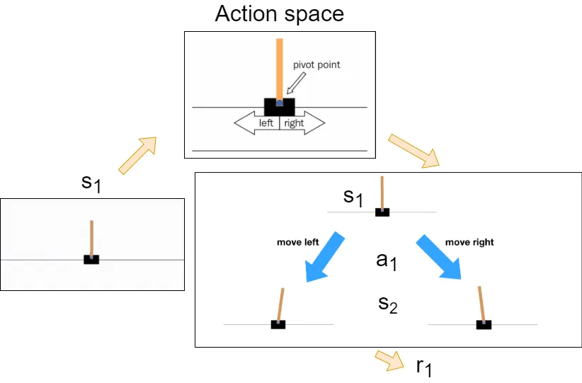

# RL Policy Gradient

## 複習RL

### 基礎components

+ Actor
+ Environment
+ Reward function

### 基礎名詞

+ State
+ Reward
+ Policy

### Policy

Policy $\pi$ 可以解釋成Actor看到一個state後決策出下一個行為的決策策略，以數學表示即 $\pi(s) = a$ ，是一個mapping的函式($\pi: S \to A$)，Policy在機器學習領域中有table實作的，但在深度學習中更常用Neural network(後簡稱NN)取代table，好比數學上table與function的關係。
在此文中將Policy定義為一個NN且NN的參數為 $\theta$。

這裡給一個例子說明，最一開始遊戲的state是$s_1$，且Action space有左移一步與右移一步兩種，policy $\pi$ 就是在environment給出state $s_1$後要決策出應該做move left還是move right，也就是 $\pi(s_1) = a_1$ —決定採取action $a_1$，做完action $a_1$後environment會變成state $s_2$以及給出一個reward $r_1$，整個遊戲過程會是$s_1, a_1 \to s_2, r_1$，$s_2, a_2 \to s_3, r_2$，$s_3, a_3 \to s_4, r_3 \cdots$一路下去直到environment回傳done代表結束了(如actor在遊戲中死掉了，或actor破關了)，一次的遊戲過程稱為一個"episode"，整個episode的總reward為$R = \sum_{t = 1}^{T} r_t$。
