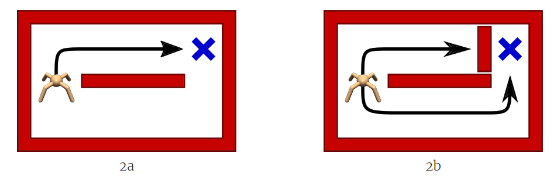
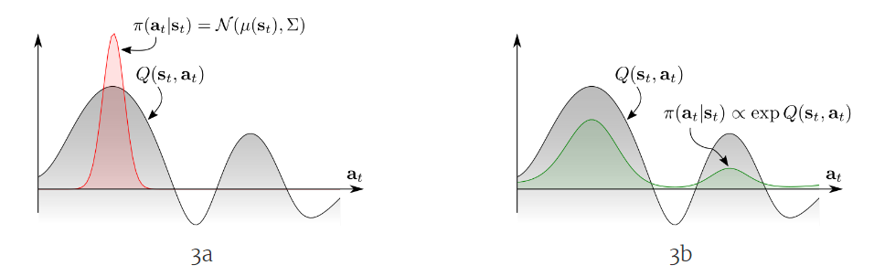
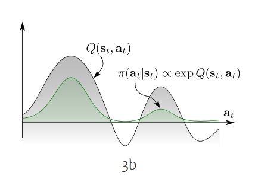

# Soft Actor-Critic (SAC)

作者: CHUN-CHENG LIN
日期: 2024/08/19

---

## 前言

SAC是在2018年被提出，於ICML上發表，可說是目前論文仍會使用的baseline之一，SAC是基於Maximum Entropy Reinforcement learning的算法，另外SAC屬於off-policy、stochastic policy，SAC完全開源，在當時的benchmark上得到很好的成績。
SAC發展的時期robot learning話題高漲(2017)，因此SAC會考慮一些現實面的因數。

原作論文(收錄於ICML 2018):
[Soft Actor-Critic: Off-Policy Maximum Entropy Deep Reinforcement Learning with a Stochastic Actor](https://arxiv.org/abs/1801.01290)

原作者code:
[https://github.com/rail-berkeley/softlearning](https://github.com/rail-berkeley/softlearning)

## Maximum Entropy Reinforcement learning

一般的RL目標是:
$$\pi^* = \mathop{\argmax}\limits_{\pi}\mathbb{E}_{a_t\sim \pi}[\sum_{t = 0}^\infin \gamma^t R(s_t,a_t,s_{t+1})]$$也就是學習policy使得累計reward加起來最大。
Maximum Entropy RL在除了使累計reward最大之外，額外要求policy輸出的action entropy要最大，方法是在目標函式中加上entropy:
$$\pi^* = \mathop{\argmax}\limits_{\pi}\mathbb{E}_{a_t\sim \pi}[\sum_{t = 0}^\infin \gamma^t (R(s_t,a_t, s_{t+1}) + \alpha H(\cdot | s_t))]$$其中的$\alpha>0$是trade-off coefficient，$H$是信息熵，令$x$為隨機變數且$P$是probability mass or density function:$$H(P) = \mathbb{E}_{x \sim P}[-\log P(x)]$$但是為什麼要加上entropy?思考entropy的意義，若entropy越大代表action distribution的機率越分散，又為什麼希望action distribution越分散?
加入entropy的理由有以下幾點:

+ Action distribution越分散代表在訓練時選到的action更有隨機性，也就代表探索性更強，增加探索性使policy更有機會學習以及逃脫局部最優。
+ 增加robust，由於在目標函式中加入entropy，這會使agent學習到更多的action組合，假設agent能夠學起來這些組合，在environment出現一些噪音時agent會更有辦法應對。

如這張圖的例子，左邊的例子說明agent學會了最快分數最高的路徑，但假設agent只會這條路徑(因為此路徑reward最高)，然而現實環境中很可能出現突發情況，如右邊的例子中原本最快路徑出現了阻礙，在一些如DDPG這樣deterministic的演算法agent幾乎不會學習其他次等的解法，agent就很可能出現問題，這也是為什麼要引入entropy到RL algorithm中。

## 加入entropy的Bellman equation

加入entropy的state-value function為:
$$V_{soft}^\pi(s) = \mathbb{E}_\pi[\sum_{t = 0}^\infin \gamma^t(R(s_t,a_t,s_{t+1}) + \alpha H(\pi(\cdot | s_t))) | s_0 = s]$$注意$V^\pi(s)$每一部都有包含entropy。
加入entropy的state-action-value function為:
$$Q_{soft}^\pi(s, a) = \mathbb{E}_\pi[\sum_{t = 0}^\infin \gamma^t R(s_t,a_t,s_{t+1})+\alpha\sum_{t = 1}^\infin\gamma^t H(\cdot | s_t) | s_0 = s, a_0 = a]$$注意這裡的$Q^\pi(s, a)$在第一步不包含entropy，這裡是跟隨OpenAI的定義，在不同論文可能有不同定義。
有了$V^\pi(s)$以及$Q^\pi(s, a)$的定義，可以將$V^\pi(s)$寫成$Q^\pi(s,a)$的形式:
$$\begin{align*}
    V_{soft}^\pi(s) &= \mathbb{E}_{a \sim \pi}[Q_{soft}^\pi(s, a)]+\alpha H(\pi(\cdot | s))\\
    &= \mathbb{E}_{a \sim \pi}[Q_{soft}^\pi(s, a)-\alpha \log\pi(a|s)]
\end{align*} $$ Bellman equation for $Q^\pi$改為:
$$\begin{align*}
    Q_{soft}^\pi(s, a) &= \mathbb{E}_{s' \sim P, a' \sim \pi}[R(s, a, s') + \gamma(Q_{soft}^\pi(s',a') + \alpha H(\cdot | s'))]\\
    &= \mathbb{E}_{s' \sim P}[R(s,a,s') + \gamma V_{soft}^\pi(s')]
\end{align*}$$

## Soft Q-Learning

> SAC應用了許多soft Q-learning的概念，所以進入SAC之前要先了解soft Q-learning

> 論文: [Reinforcement Learning with Deep Energy-Based Policies](https://arxiv.org/abs/1702.08165)
> 於ICML 2017收錄，與SAC同作者。

### 與Q-Learning的差別

左圖是一般的Q-learning，但是這裡指的Q-learning是actor-critic的critic，左邊的灰色分布指出$Q^\pi$的預測，有兩個高峰，之前的方法使得policy只會收斂於一個高峰(兩個局部最大中的一個)，右邊的是soft Q-learning的效果，加入entropy之後配合stochastic policy，policy的決策涵蓋了更多可能，這增加了robust(後面解釋policy的實作)。
另外，soft Q-learning使用上面介紹的包含entropy的Bellman equation。

### Energy Based Policy (EBP)

在Maximum Entropy RL中policy不再是以往由$\mu、\sigma$決定的normal distribution，而是用energe-based model (EBM)來實作policy。
EBM是由物理統計力學中的Boltzmann distribution轉化而來，整個EBM的演進及推導在此不詳述，在數學是寫作:
$$\pi(a_t | s_t) \propto \exp(-\mathcal{E}(s_t, a_t))$$其中$\mathcal{E}$是能量函數，其意義是agent with policy $\pi$看到$s_t$後採取$a_t$的機率正比於$\exp(-\mathcal{E}(s_t, a_t))$，至於為什麼有$\exp$以及$\exp$中的負號是從Boltzmann distribution轉成EBM時推導中產生的。
論文中作者將能量函數$\mathcal{E}$定義成(以神經網路擬合，與$Q$結合):
$$\mathcal{E}(s_t,a_t) = -\frac{1}{\alpha}Q_{soft}(s_t,a_t)$$其中$\alpha > 0$，帶入後得:
$$\pi(a_t | s_t) \propto \exp(\frac{1}{\alpha}Q_{soft}(s_t, a_t))$$這可以用一個簡單直觀的解釋，當看到$s_t$採取$a_t$的$Q$越大，則agent看到$s_t$採取$a_t$的機率就越大，這也是為什麼policy變成下圖的分布。

### Soft Q-Learning的Policy Evaluation與Policy Improvement

> 此小節說明soft Q-learning的policy evaluation與policy iteration以及value iteration。

> 在此節主要是說明soft Q-learning，且soft Q-learning雖然是SAC的前身，但是soft Q-learning用的value function以及value iteration與SAC的定義不同。

#### (1) Soft Policy Evaluation

原版Q-learning利用policy evaluation迭代得到$Q^\pi$，在soft Q-learning由於function定義不同所以也要重新定義policy evaluation。
Soft Q-learning的state value function:
$$V_{soft}(s) = \alpha\log\int\exp(\frac{1}{\alpha}Q_{soft}(s, a))da$$其中的$\log\int\exp$是一種LogSumExp(LSE)的式子，也稱作RealSoftMax，這也是為什麼Soft Q-learning名字裡有個"Soft"，看到這可能有人會有疑問，機器學習更常用的softmax不長這樣?其實是因為更常看到的softmax被誤用名稱了，久了就變正確，另外所謂的"hardmax"其實就是最一般的max，另外$\frac{1}{\alpha}$中的$\alpha$越靠近0，softmax就越靠近hardmax。

## Reference

+ [OpenAI SAC](https://spinningup.openai.com/en/latest/algorithms/sac.html)
+ [Energy-based model 以及 Bayesian model 的關聯](https://yuehhua.github.io/2018/09/12/energy-model-bayesian/)
+ [Soft Q-Learning论文阅读笔记](https://zhuanlan.zhihu.com/p/76681229)
+ [Reinforcement Learning with Deep Energy-Based Policies論文筆記](https://stepneverstop.github.io/rl-with-deep-energy-based-policies.html)
+ [SAC(Soft Actor-Critic)阅读笔记](https://zhuanlan.zhihu.com/p/85003758)
+ [最前沿：深度解读Soft Actor-Critic 算法](https://zhuanlan.zhihu.com/p/70360272)

---
## 未完工
